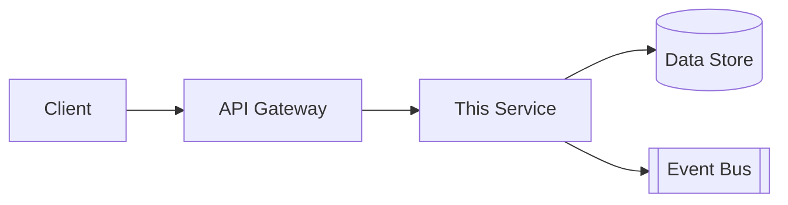
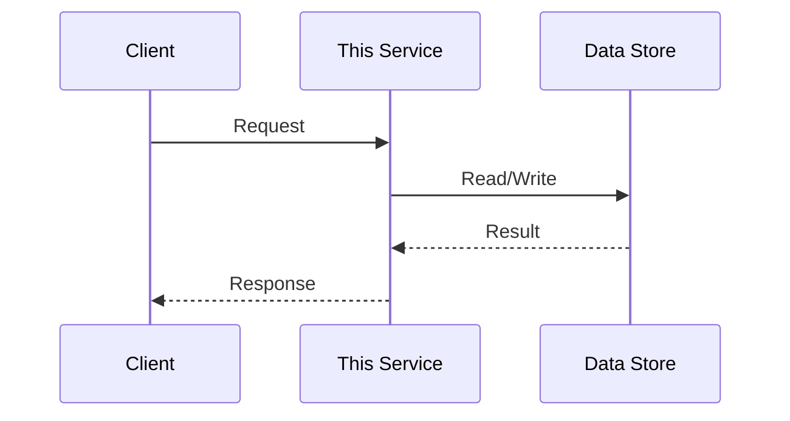

<!--
ARCHITECTURE / DESIGN TEMPLATE
File naming convention: DES-<APP-CODE>-<NNN>.md
One design doc per Feature (or per Requirement, if a Feature spans several designs).
Pair this with api-template.yaml and data-model-template.md when the design involves a new API or entity.
-->

# DES-<APP-CODE>-<NNN>: <Component / Service Name>

| Field | Value |
|---|---|
| Design ID (required) | DES-<APP-CODE>-<NNN> |
| Requirement(s) covered | REQ-<APP-CODE>-<NNN> |
| Application | |
| Capability | |
| Microservice / Module | <e.g. paas-catalog-service> |
| Author | |
| Status | Draft / In Review / Approved |
| Reviewers | |

## Overview
<One paragraph: what this component does and why it exists.>

## Architecture Decision
<If this design makes or depends on a significant architectural choice, reference or embed an ADR here (see adr-template.md). Otherwise state "No new architectural decision — follows existing patterns.">

## Component Diagram

## Interfaces
| Direction | Interface | Contract Reference |
|---|---|---|
| Inbound | <e.g. REST endpoint> | API-<APP-CODE>-<NNN> (see api-template.yaml) |
| Outbound | <e.g. event published> | EVT-<NNN> |
| Outbound | <e.g. downstream service call> | |

## Data Model
<Reference data-model-template.md, or inline the entities this component owns.>

## Sequence (key flow)

## Security Considerations
<AuthN/AuthZ model, tenant isolation approach, data classification, secrets used.>

## Multi-Region / Multi-Tenant Considerations
<Does this component run per-region? Does state need to stay in a residency boundary? How is tenant context propagated?>

## Non-Functional Targets
<Latency, throughput, availability targets specific to this component — reference the platform NFR catalog and note any deviation.>

## Failure Modes & Rollback
<What happens when a dependency is unavailable? Is this operation idempotent/retryable?>

## Open Questions
- <Anything unresolved that needs a decision before implementation starts>
