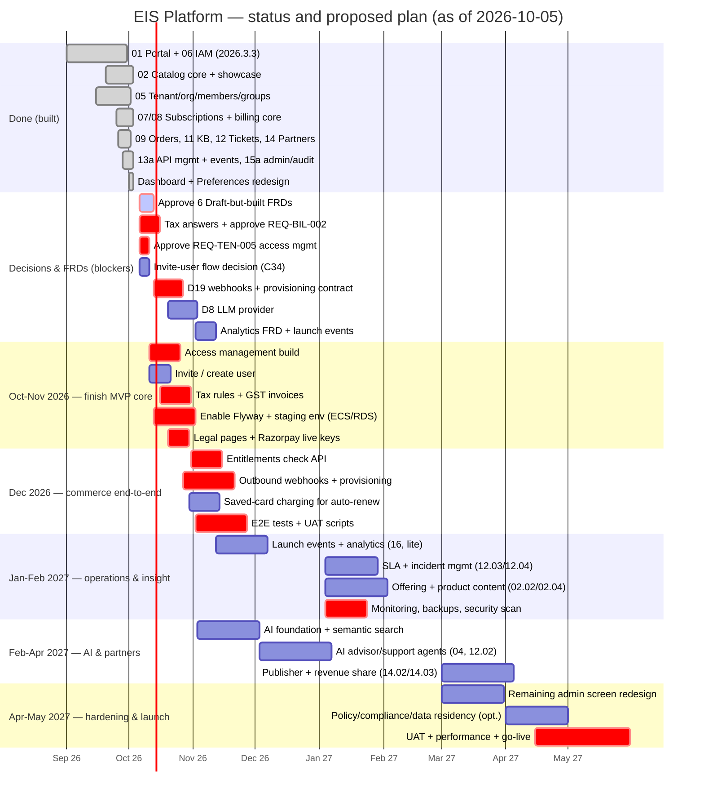

# EIS Platform — Project status report

| Field | Value |
|---|---|
| As of | 2026-10-05 (current sprint: [2026.4.1](sprints/SPRINT-2026.4.1.md), 1–31 Oct 2026) |
| Branch / commit | `dev` @ `2276849` (CI green on `dev` and `main`) |
| Method | Verified against the code, tests, sprint pages, FRDs and [open-decisions.md](open-decisions.md) — a feature counts as built only if backend code, UI and automated tests exist for it |
| Tests | Backend 430 (65 test classes), frontend 302 (65 files); 0 end-to-end browser tests |

**Key fact:** development has run ahead of the calendar. Only sprint 2026.3.3 (September) is in the past; every later sprint (Oct 2026 – May 2027) already has part of its scope built and part not started.

---

## 1. Completed

### Completed sprint
| Sprint | Scope | Status |
|---|---|---|
| 2026.3.3 (Sep 2026) | 01 Portal (layout, accessibility, notifications, preferences, status page), 06 Identity & Access (Keycloak SSO, MFA + recovery, org MFA policy, SAML + OIDC federation, claim mapping, RBAC, privileged access) | **Complete** |

### Working modules (built + UI + tests; FRD Approved unless noted)
| Area | What works |
|---|---|
| Identity & access | Sign-in, MFA, recovery codes, admin MFA reset, org MFA policy, SAML/OIDC federation + claim mapping, roles & permissions admin, privileged access (request/approve/revoke), sessions |
| Organization | Registration + verification, organization lifecycle, member roles, suspend/reactivate/remove, review access, groups, tenant region/policies, seat limits |
| Catalog | Products (apps) + platforms, lifecycle (publish/retire/revision), hierarchy/variants/dependencies, plans/tiers/currency, public catalog + showcase (C66) |
| Marketplace | Browse/search/filter/sort, recommendations, reviews & ratings, cart + checkout (*FRD Draft*) |
| Subscriptions | Subscribe, suspend/reactivate/cancel/renew, change plan, expiry job, seats (*Draft*), auto-renew + reminders (*Draft*) |
| Billing | Invoices, payments via Razorpay (**gateway not configured**), offline payments, refunds, billing settings, spend on dashboard (*FRD Draft*) |
| Orders | Organization orders with single-step approval |
| Support & knowledge | Tickets (human), knowledge base articles |
| Integration | API keys, rate limits, `/v1` alias, usage (*Draft*); event outbox + dispatcher + admin view (*Draft*) |
| Partners | Provider registration/verification/approval, contracts + expiry job |
| Administration | Platform config (currencies, flags, languages, regions), audit log, service status admin, platform admin dashboard |
| Portal UX | Business dashboard workspace (C69), Preferences (C67/C68), global keyword search |

---

## 2. Partially completed (in progress)

| Sprint | Built | Not built / remaining |
|---|---|---|
| 2026.4.1 Oct (02 Catalog, 05 Tenant) | 02.01, 02.03, catalog showcase, 05.02–05.04.01 | 02.02 Offering mgmt, 02.04 Product content (datasheets/media), 02.05.01 content localization; redesign of remaining admin screens (theme only) |
| 2026.4.2 Nov (05 carry-over, 13a, 15a) | Tenant lifecycle, API mgmt, event platform, platform admin, audit | **05.03.01 Invite/create user**, 05.04.02 Projects, **REQ-TEN-005 Access management (awaiting approval)**, event replay, config defaults/templates |
| 2026.4.3 Dec (07, 08) | Subscription lifecycle, seats, renewals, billing core, cart/checkout | **07.02 Entitlements**, 07.03 Licence & quota, **08.05.01 Tax**, 08.01 price books/promotions, 08.02.01 usage billing, saved-card charging, live Razorpay |
| 2027.1.1 Jan (09, 11a, 13b, 16) | Orders + approvals, knowledge base | **09.02 Provisioning (REQ-ORD-002)**, approval routing/escalation, 11.01.02 AI knowledge, 13.02 connectors, 13.04 webhooks, **16 Analytics (all)** |
| 2027.1.2 Feb (04a, 10, 03a, 12a) | Recommendations, tickets | 04a AI orchestration, **10 Service & resource mgmt (all)**, 12.03 SLA, 12.04 incident & problem |
| 2027.1.3 Mar (01b, 04b, 03b, 11b, 15b) | Keyword search, reviews, dashboard | Semantic search, 04b AI agents, 12.02 AI support, 03.02 evaluation/trials, 03.04.02 comparison, 11b learning/certification, 15b policy & compliance |
| 2027.2.1 Apr (14) | Provider lifecycle, contracts | 14.02 publisher mgmt, 14.03 revenue sharing, 14.04 partner operations |
| 2027.2.2 May (15c) | Region management | 15.05.02 data residency |

## 3. Not started

| Application / feature | Why not started |
|---|---|
| 04 AI Advisor & Agent Platform (all 6 features) | LLM provider (D8) not decided; `ai-service` is a health-check stub |
| 10 Service & Resource Management (all) | FRD REQ-SRM-001 is a stub; depends on provisioning |
| 16 Analytics & Data Platform (all 9) | No FRD; no event/launch history recorded |
| 11.02–11.04 Learning, delivery, certification | P1/stretch, no FRD |
| 15.02 Policy mgmt, 15.04 Compliance, 15.05.02 Data residency | Policy-engine scope undecided |
| 02.02 Offering, 02.04 Content, 02.05.01 Localization | No FRD |
| 07.02 Entitlements, 07.03 Licence & quota | Entitlements FRD Draft; licensing undecided |
| 08.01 Price books/promotions, 08.02.01 Usage billing, 08.05.01 Tax | Out of MVP (C50) / tax FRD Draft |
| 09.02 Provisioning, 09.03 Orchestration | Contract with hosted products not agreed (D13/D19) |
| 12.02 AI support, 12.03 SLA, 12.04 Incident & problem | D8 / data model undecided |
| 13.02 Connectors, 13.04 Outbound webhooks | D19 not decided |
| 14.02–14.04 Publisher, revenue share, partner ops | Ownership model / billing / partner role undecided |
| 05.03.01 Invite user, 05.04.02 Projects | C34 / C35 decisions pending |

---

## 4. Project gaps (risks)

| # | Area | Gap | Why it matters |
|---|---|---|---|
| 1 | Process | 6 FRDs are **Draft but built** (REQ-BIL-001, MKT-003, SUB-003, SUB-004, INT-001, INT-002) | Breaks CLAUDE.md rule 2; engineering defaults may not match the business answer |
| 2 | Billing | **No tax** on invoices (REQ-BIL-002 Draft) | Invoices not GST-compliant in India |
| 3 | Billing | Razorpay credentials not configured; no saved-card (token) charging | No real money flow; auto-renew can't charge |
| 4 | Provisioning | Buying a product does not create anything in the hosted product (REQ-ORD-002 stub) | Customers pay but get no tenant |
| 5 | Entitlements | Hosted products cannot check what a customer is entitled to (REQ-SUB-002) | Access control in products relies on manual setup |
| 6 | Members | No **invite / create user** flow (C34) | Org admins cannot add people themselves |
| 7 | Database | Flyway **disabled**; `schema.sql` applied by hand alongside 20 migrations | Schema drift between environments |
| 8 | Deployment | `deployment/environments`, `ecs`, `nginx` contain only READMEs; no staging | Nothing verified outside local Docker |
| 9 | Scaling | Rate limits per instance; uploads on local disk | Breaks with more than one backend instance |
| 10 | Testing | No end-to-end, load, or security scan; UAT scripts only for access management | Integration bugs reach users |
| 11 | Ops | No monitoring, alerting, log aggregation or backup plan documented | Outages go unnoticed |
| 12 | Legal | No Terms, Privacy, Refund pages (checkout consent needs them) | Cannot go live commercially |
| 13 | Email | Templates & editing undecided (D27); production SMTP not documented | Reminder/notification emails unmanaged |
| 14 | Data | No launch/usage history | No trends, no analytics (16) |
| 15 | UI | Many admin screens only themed; some dates bypass shared formatters | Inconsistent experience |
| 16 | Preferences | Accent and formats stored per browser only | Not consistent across devices |
| 17 | Quality | 12 pre-existing lint errors (non-blocking in CI) | Hides new problems |

## 5. FRD status

| Status | FRDs |
|---|---|
| **Approved & built** (25) | catalog-showcase, claim-mapping, global-search, group-management, knowledge-base, member-lifecycle, member-role-assignment, mfa-recovery, oidc-federation, order-lifecycle, organization-lifecycle, organization-mfa-policy, plan-management, platform-administration, privileged-access, product-lifecycle, product-recommendations, product-reviews, provider-onboarding, role-permission-administration, saml-federation, service-status-page, subscription-lifecycle, tenant-lifecycle, ticket-management |
| **Draft but built** (6) — approve or amend | billing-payments, cart-checkout, subscription-seats, renewal-reminders, api-management, event-platform |
| **Draft, not built** (3) — need answers | access-management (REQ-TEN-005), entitlements (REQ-SUB-002), tax-rules (REQ-BIL-002) |
| **Stub only** (2) | provisioning-contract (REQ-ORD-002), service-instances (REQ-SRM-001) |
| **No FRD** | 02.02 Offering, 02.04 Product content, 02.05.01 Localization, 05.03.01 Invite user, 05.04.02 Projects, 04 AI (all), 07.03 Licence & quota, 08.01 Price books/promotions, 08.02.01 Usage billing, 11.01.02 AI knowledge, 11.02–11.04, 12.02–12.04, 13.02, 13.04 Webhooks, 14.02–14.04, 15.02, 15.04, 15.05.02, 16 Analytics (all), semantic search, launch-event recording |

**Document before development (priority order):** tax-rules, access-management, entitlements, provisioning-contract, invite user, webhooks, analytics/launch events, service-instances, AI platform (after D8).

## 6. Decisions required (product owner)

| # | Decision | Why needed | Recommendation |
|---|---|---|---|
| 1 | Approve REQ-TEN-005 Access management | Blocks build of access screen and org subscription actions | Approve with proposed defaults |
| 2 | Approve/amend 6 Draft-but-built FRDs | Code runs on engineering defaults | Review open questions; approve |
| 3 | Tax: inclusive vs exclusive; GST CGST/SGST vs IGST | Blocks tax and compliant invoices | Exclusive pricing, GST split by state |
| 4 | Activation vs payment | Today activation happens before payment | Activate on first payment for self-serve; immediate for approved org orders with due date |
| 5 | Invoice number format & due terms | Needed for legal invoices | `EIS/FY26-27/000123`, 15 days |
| 6 | D8 LLM provider | Blocks all AI (04, 11.01.02, 12.02, semantic search) | Anthropic Claude via API; pgvector already chosen (C58) |
| 7 | D19 Webhooks | Blocks provisioning delivery and integrations | Outbound signed webhooks on the existing outbox |
| 8 | Provisioning contract with hosted products | Purchases do nothing in products | Webhook + retry, per-product secret |
| 9 | Invite / create user flow (C34) | Admins cannot add members | Email invite via Keycloak action link |
| 10 | Projects model (C35) | 05.04.02 blocked | Defer (P1) unless a product needs it |
| 11 | Seats: pool vs named; proration | Billing correctness | Pool seats; charge increases next renewal |
| 12 | Auto-renew off behaviour | Renewal flow incomplete | Allow off; expire at end date, 7-day grace |
| 13 | D23 product media storage | Blocks 02.04 content, multi-instance uploads | S3 |
| 14 | D27 email/platform templates | Who edits emails | Admin-editable templates, v2 |
| 15 | D42 cloud API gateway | Rate limiting at scale | AWS API Gateway later; keep in-app limits for now |
| 16 | Deployment target & environments | No staging | AWS ECS + RDS PostgreSQL 16 (with pgvector) |
| 17 | Enable Flyway | Schema drift risk | Enable with baseline at V019 |
| 18 | Scope of P1/stretch apps (04, 10, 11b, 15b, 16) | Determines end date | Keep 16 (lite) and 04 in MVP+; defer 10, 11b, 15b |
| 19 | Record launch events (C69) | Enables trends/analytics | Yes — small additive table |
| 20 | Cross-device preferences (C67) | Accent/formats per browser | Yes — add columns to `customer_preferences` |
| 21 | Legal pages content | Checkout consent | Provide Terms, Privacy, Refund URLs |

## 7. Questions for the product owner

**Organization & access (05, 06)**
1. How do new members join an organization today and in future — invite email, admin-created account, domain auto-join, or SSO only?
2. Do Members get all entitled products by default (REQ-TEN-005 Q1)?
3. Is "Manage billing" separate from "Manage subscriptions"? Its code?
4. Does granting product access consume a seat?
5. Should members be notified when their access changes?
6. Is a "project" needed at all, and what does it own?

**Catalog & marketplace (02, 03)**
7. What is an "offering" vs a product/plan — bundles, prerequisites, regions, channels, eligibility needed for MVP?
8. Product content: datasheets, videos, case studies — who uploads, where stored (D23)?
9. Should release versions of apps be tracked and shown?
10. Product evaluation/trials: free trial length, limits, auto-conversion?
11. Product comparison needed?

**Subscriptions & billing (07, 08)**
12. Tax: inclusive/exclusive? GST split? External tax service?
13. Activation before or after first payment?
14. Invoice numbering, due days, legal fields (GSTIN/PAN/CIN)?
15. Who may Pay by invoice; partial offline payments allowed?
16. Refund policy: who, partial/full, time limit?
17. Seats: pool or named; mid-term proration?
18. Can customers turn auto-renew off; grace period?
19. Razorpay live credentials — when, and which account?
20. Entitlement check contract — which hosted products, by when?

**Orders & provisioning (09, 10)**
21. Which hosted products must be provisioned at launch, and can each team implement the contract?
22. Multi-level approvals (amount thresholds, escalation) needed?
23. What happens when provisioning fails — retry, refund, state?
24. Service instances: who sees them, health values?

**AI (04, 11.01.02, 12.02, semantic search)**
25. LLM provider and data-residency constraints for AI?
26. Which AI use cases are MVP — advisor, support bot, knowledge Q&A, search?

**Support (12)**
27. SLA tiers per plan? Response/resolution targets?
28. Incident/problem: link to service-status incidents?

**Integration & partners (13, 14)**
29. Who gets API keys; scopes; per-plan rate limits?
30. Webhooks: which events, consumers, retry policy?
31. Publishers: can partners list their own products? Revenue share %?

**Governance & analytics (15, 16)**
32. Compliance standards targeted (ISO 27001, SOC 2, GDPR, DPDP Act)?
33. Data residency regions required?
34. Analytics: who are the users (org admins, platform admins), which KPIs?

**Delivery**
35. Target go-live date and which apps must be live on day one?
36. Who performs UAT and sign-off per application?
37. Expected load (organizations, users) for the first year?

---

## 8. Gantt chart

Legend: `done` = completed, `active` = in progress, `crit` = critical path, plain = not started. Dates from today (2026-10-05) are a proposed realistic sequence; dependencies use `after`.

**Critical path:** FRD approvals → tax → Razorpay live → entitlements + provisioning (needs D19 and hosted-product teams) → staging + E2E → UAT → go-live.
**Blockers:** D8 (AI), D19 (webhooks/provisioning), hosted-product team commitments, Razorpay credentials, tax answers.

## 9. Improvement suggestions

### Essential
| Suggestion | Benefit |
|---|---|
| Approve Draft FRDs and close open questions | Removes rule-2 risk |
| Enable Flyway; add staging; automate deploy | Reliable releases |
| Move uploads to S3; shared rate-limit store (Redis/DB) | Multi-instance safe |
| E2E tests (Playwright) for sign-in, buy, approve, pay | Catches integration bugs |
| Monitoring (health, error tracking, uptime), backups | Operability |
| Fix 12 lint errors; make lint blocking | Code quality |
| Legal pages + cookie/consent | Commercial readiness |
| Member invite flow | Core admin task |
| Store accent/format preferences on the account | Consistent experience |

### Optional
| Suggestion | Benefit |
|---|---|
| Launch-event log → launches-over-time chart, period filters, member trends | Real analytics on dashboards |
| Organization audit-log page with filters/export | Self-service compliance |
| Shared `DataTable`/`FilterBar` (C44) and redesign of remaining admin screens | Consistency, less code |
| Command palette (Ctrl+K) over global search | Faster navigation |
| In-app onboarding checklist for new org admins | Faster activation |
| Usage alerts (seat limit, renewal) as email digests | Proactive admin |
| Product comparison and trials | Better buying decisions |
| Saved filters/views on admin tables | Productivity |
| Skeleton + optimistic updates everywhere; toast undo for destructive actions | Perceived speed, safety |
| Dark-mode audit of charts | Visual polish |

## 10. Final roadmap

| Category | Items |
|---|---|
| **Completed** | Sprint 2026.3.3; 25 Approved FRDs built; catalog, orgs, subscriptions, billing core, orders, KB, tickets, partners onboarding, API keys/events, admin/audit, dashboards, preferences |
| **In progress** | Sprint 2026.4.1 (Oct): catalog remainder; FRD approvals; access management (awaiting approval) |
| **Not started** | 04 AI, 10 SRM, 16 Analytics, 11b, 15b, 15.05.02, 02.02/02.04/02.05.01, 07.02/07.03, 08 tax/price books/usage, 09.02 provisioning, 12.02–12.04, 13.02/13.04, 14.02–14.04, invite user, projects |
| **Blocked** | AI features (D8), provisioning/webhooks (D19 + hosted teams), tax (answers), access mgmt (approval), live payments (Razorpay keys), data residency (policy engine) |
| **Decisions required** | 21 (section 6) |
| **Questions awaiting answers** | 37 (section 7) + open questions inside 11 Draft/stub FRDs |
| **Missing FRDs** | ~25 feature areas (section 5) |
| **Recommended improvements** | 9 essential, 10 optional (section 9) |
| **Next sprint (2026.4.2, Nov)** | Access management, invite user, tax + GST invoices, Flyway + staging, legal pages + Razorpay live, provisioning contract approval |

### Completion
| Measure | Value | Basis |
|---|---|---|
| Features, full roadmap scope (114 features, 16 apps) | **≈41%** | 40 done, 13 partly (counted half), 61 not started |
| MVP / P0 scope (excluding P1/stretch apps 04, 10, 11b, 15b, 16) | **≈60%** | Same count limited to P0 applications |
| Production readiness | **≈35%** | No tax, payments not live, no provisioning, no staging/monitoring/E2E |
