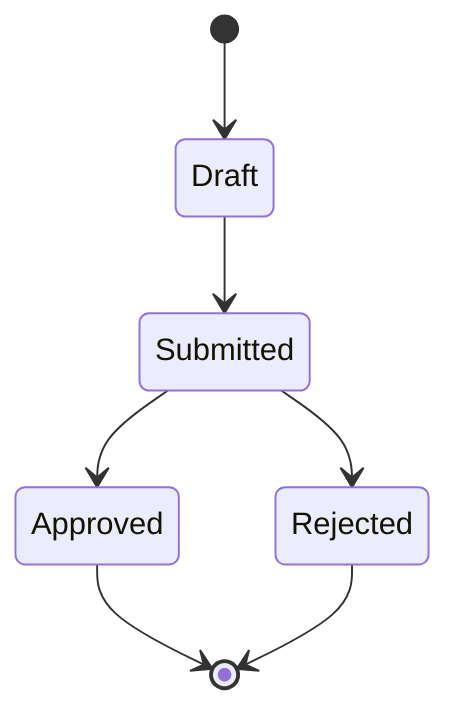

# Workflow — <Feature Name>

## States

## Transitions
| From | To | Actor | Condition / rule | Side effects (notifications, audit) |
|------|----|-------|------------------|-------------------------------------|
| Draft | Submitted | <actor> | <BR-…> | <…> |
