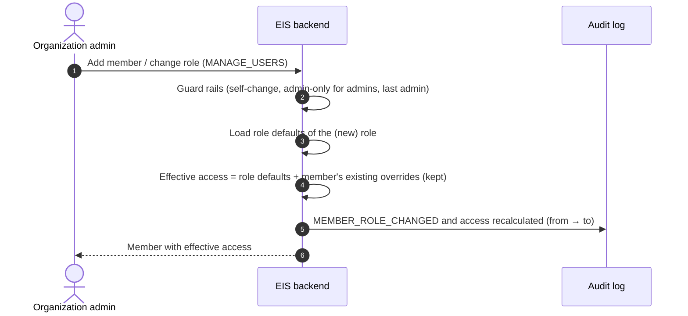
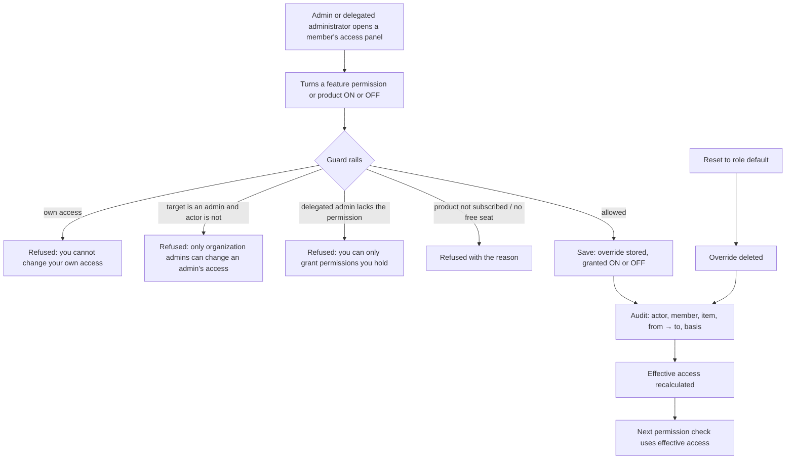
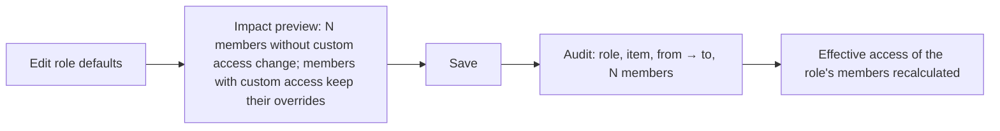

# Workflow — Access management (REQ-TEN-005)

## (a) A member joins or changes role → role defaults applied

```mermaid
sequenceDiagram
    autonumber
    actor Admin as Organization admin
    participant EIS as EIS backend
    participant Audit as Audit log
    Admin->>EIS: Add member / change role (MANAGE_USERS)
    EIS->>EIS: Guard rails (self-change, admin-only for admins, last admin)
    EIS->>EIS: Load role defaults of the (new) role
    EIS->>EIS: Effective access = role defaults + member's existing overrides (kept)
    EIS->>Audit: MEMBER_ROLE_CHANGED and access recalculated (from → to)
    EIS-->>Admin: Member with effective access
```

## (b) Individual override → audit → effective access

```mermaid
flowchart TD
    A[Admin or delegated administrator opens a member's access panel] --> B[Turns a feature permission or product ON or OFF]
    B --> C{Guard rails}
    C -- own access --> X[Refused: you cannot change your own access]
    C -- target is an admin and actor is not --> X2[Refused: only organization admins can change an admin's access]
    C -- delegated admin lacks the permission --> X3[Refused: you can only grant permissions you hold]
    C -- product not subscribed / no free seat --> X4[Refused with the reason]
    C -- allowed --> D[Save: override stored, granted ON or OFF]
    D --> E[Audit: actor, member, item, from → to, basis]
    E --> F[Effective access recalculated]
    F --> G[Next permission check uses effective access]
    R[Reset to role default] --> R1[Override deleted] --> E
```

## (c) Role defaults change

```mermaid
flowchart LR
    A[Edit role defaults] --> B[Impact preview: N members without custom access change; members with custom access keep their overrides]
    B --> C[Save] --> D[Audit: role, item, from → to, N members] --> E[Effective access of the role's members recalculated]
```
