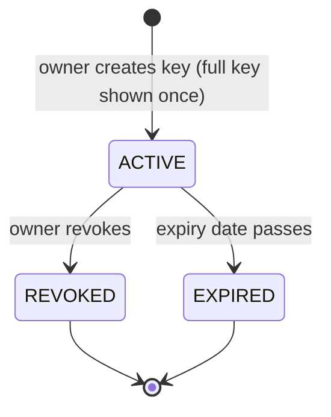
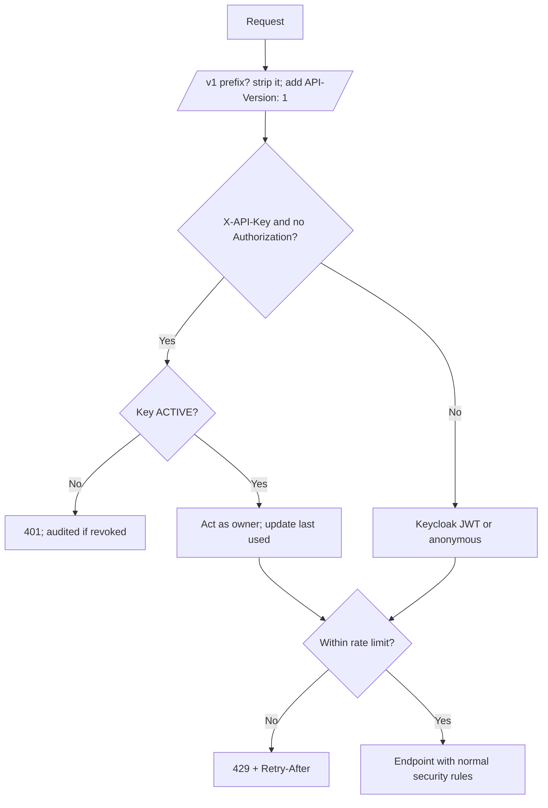

# Workflow — API management (REQ-INT-001)

## Key lifecycle

```mermaid
stateDiagram-v2
    [*] --> ACTIVE: owner creates key (full key shown once)
    ACTIVE --> REVOKED: owner revokes
    ACTIVE --> EXPIRED: expiry date passes
    REVOKED --> [*]
    EXPIRED --> [*]
```

## Request

```mermaid
flowchart TD
    A[Request] --> V[/v1 prefix? strip it; add API-Version: 1/]
    V --> K{X-API-Key and no Authorization?}
    K -- Yes --> K2{Key ACTIVE?}
    K2 -- No --> R401[401; audited if revoked]
    K2 -- Yes --> AUTH[Act as owner; update last used]
    K -- No --> J[Keycloak JWT or anonymous]
    AUTH --> RL{Within rate limit?}
    J --> RL
    RL -- No --> R429[429 + Retry-After]
    RL -- Yes --> E[Endpoint with normal security rules]
```
