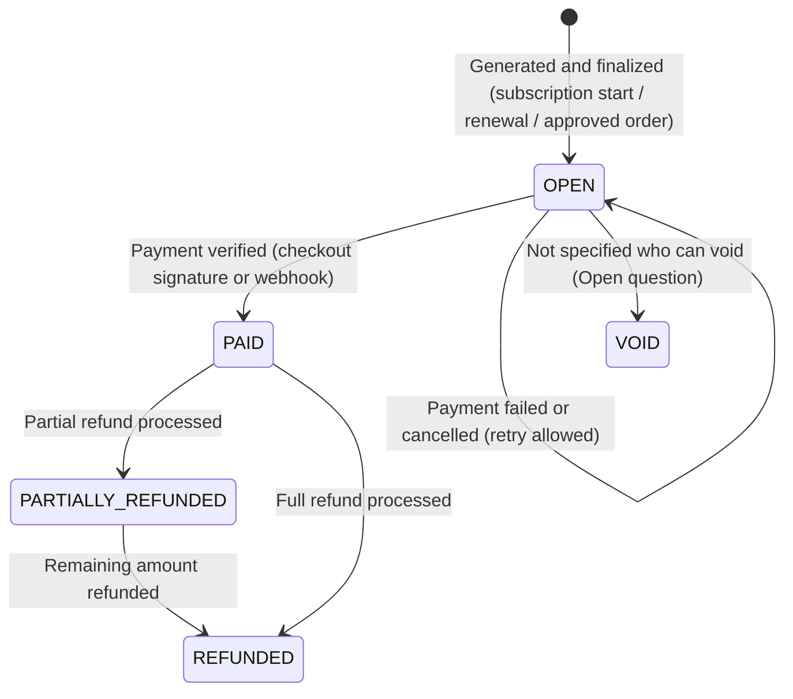
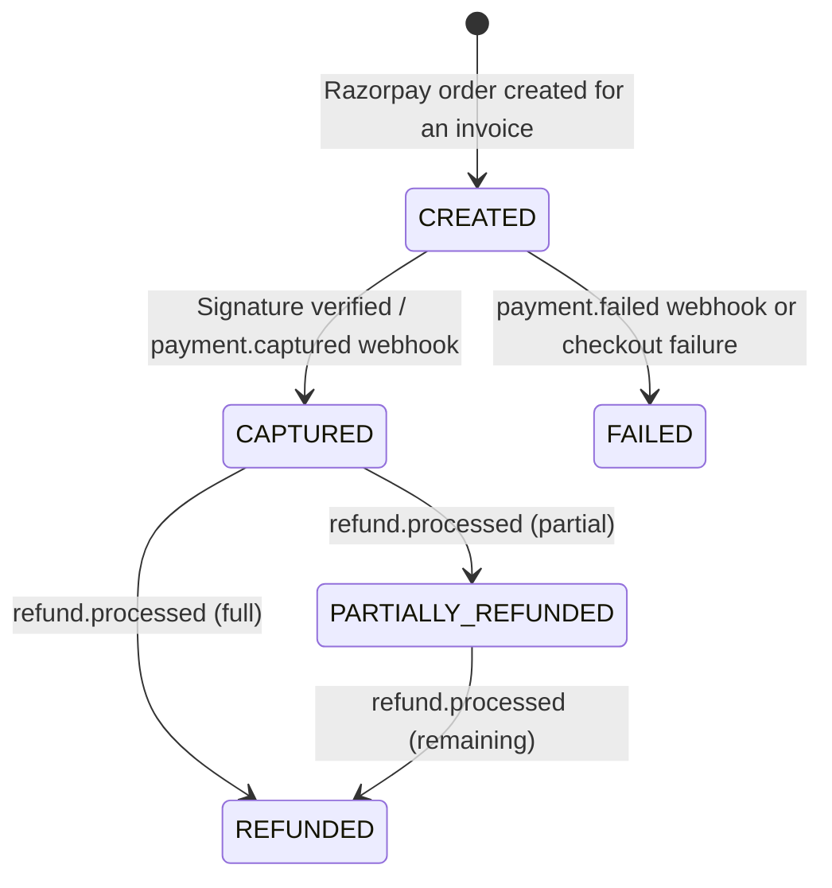

# Workflow — Billing & Payments (REQ-BIL-001)

The end-to-end flow across subscriptions, orders and billing is in [docs/04-workflows/purchase-to-payment.md](../../../04-workflows/purchase-to-payment.md). This file covers the states inside this feature.

## Invoice states

`VOID` is listed because an unpaid invoice must be cancellable in some way; who may void and when is **Not specified**.

## Payment states

Authorize and capture happen together (Razorpay auto-capture). Separate authorize-then-capture is Not specified.

## Payment method states
`ACTIVE` (saved token usable) → `REMOVED` (customer removed it; token deleted at Razorpay). Card expiry is shown; expired cards are marked **Expired** and cannot be set as default.

## Actors
| Step | Actor |
|---|---|
| Edit billing details, pay, add/remove payment methods | Customer, or organization billing user (Open question 5) |
| Refund, reconcile, view all | Platform admin (`MANAGE_BILLING`) |
| Payment confirmation | Razorpay (checkout result + webhook) |
