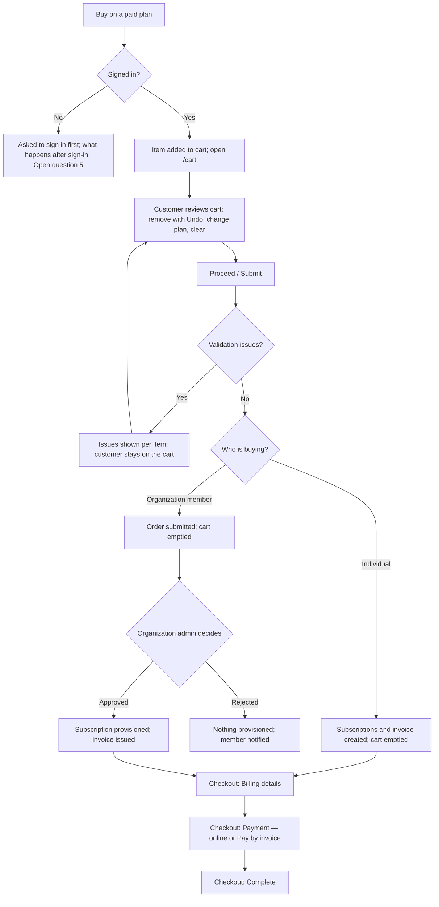

# Workflow — Cart and checkout (REQ-MKT-003)

The flow across features (cart → subscription or order → invoice → payment) is in [docs/04-workflows/purchase-to-payment.md](../../../04-workflows/purchase-to-payment.md).

## Flow

## Cart item states
A cart item has no stored status. Its validation result is calculated when the customer continues, and again when the checkout is created.

| Result | Meaning | Customer action |
|---|---|---|
| OK | No issue | — |
| `NOT_AVAILABLE` | The product is no longer published, or the plan was removed | Remove the item, or change the plan |
| `PRICE_CHANGED` | The price differs from the price when the item was added | Confirm the new price, or remove the item |
| `ALREADY_SUBSCRIBED` | An ACTIVE subscription to the product exists | Remove the item |
| `MISSING_DEPENDENCY` | A required product is neither owned nor in the cart | Add the required product, or remove the item |

## Transitions
| From | To | Actor | Condition / rule | Side effects |
|---|---|---|---|---|
| (none) | Item in cart | Customer | Paid plan; BR-2, BR-3 | Toast; cart badge count updates |
| Item in cart | Removed | Customer | — | Toast with Undo for about 5 s; Undo restores the item |
| Cart | Checkout created (individual) | Customer | No issues (BR-6, BR-7) | Subscriptions and invoice created; cart emptied; invoice audited (REQ-BIL-001.17) |
| Cart | Order submitted (organization) | Organization member | No issues | Order created (REQ-ORD-001); cart emptied; audited |
| Order submitted | Approved → invoice issued | Organization admin | REQ-ORD-001 | Subscription provisioned; invoice issued; member pays through the checkout |
