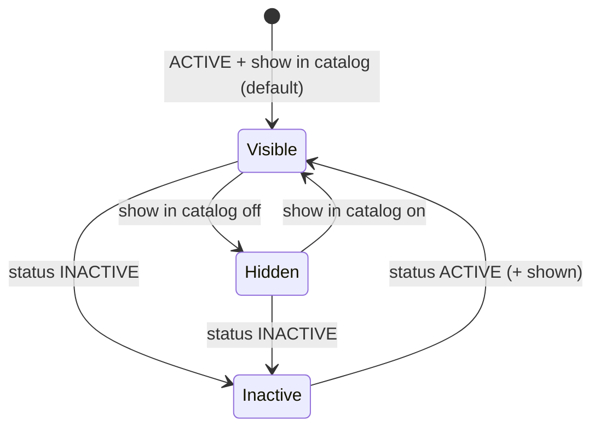

# Workflow — Catalog Showcase

No new lifecycle. A platform's catalog visibility is a combination of two settings:

## Transitions
| From | To | Actor | Condition / rule | Side effects (notifications, audit) |
|------|----|-------|------------------|-------------------------------------|
| Any | Any | Platform administrator | BR-CAT-301 | None beyond the existing platform update |

App status keeps the [product-lifecycle](../product-lifecycle/workflow.md) workflow (Active / Inactive / Retired).
