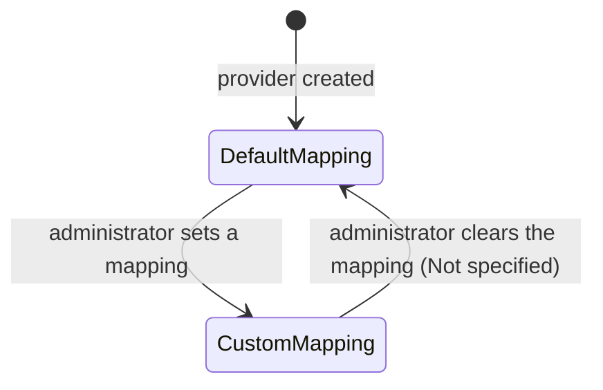

# Workflow — Configurable Claim Mapping

## States

## Transitions
| From | To | Actor | Condition / rule | Side effects (notifications, audit) |
|---|---|---|---|---|
| Default mapping | Custom mapping | Organization administrator | Not specified | Not specified |
