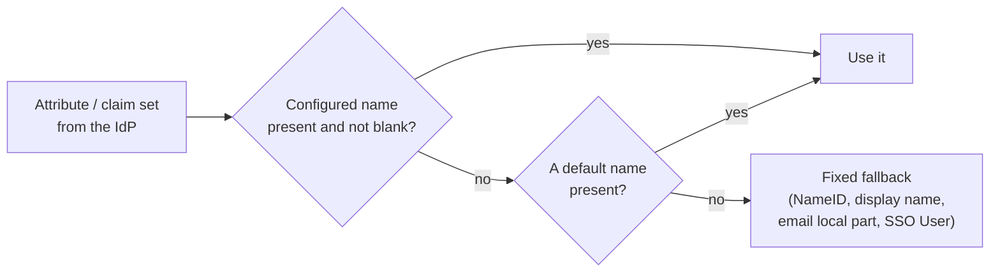

# Workflow — Claim Mapping

```mermaid
flowchart LR
  A["Attribute / claim set\nfrom the IdP"] --> B{"Configured name\npresent and not blank?"}
  B -- yes --> V["Use it"]
  B -- no --> C{"A default name\npresent?"}
  C -- yes --> V
  C -- no --> D["Fixed fallback\n(NameID, display name,\nemail local part, SSO User)"]
```
