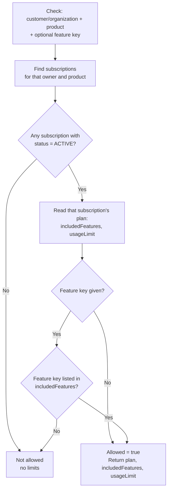

# Workflow — Entitlements (REQ-SUB-002)

## Derivation flow (every check, no stored state)

Nothing here is written or cached — the same computation runs on every call, directly against the subscription's live status and its plan's live fields. There is no grant/revoke step and nothing to keep in sync.

## Actors
| Step | Actor |
|---|---|
| View own entitlements | Customer |
| View organization entitlements | Organization member, per existing organization permissions |
| Call the internal check | Hosted product backend, via the internal SSO bridge secret |
| Call the customer-facing check | Platform UI (My products, organization subscriptions view) |
