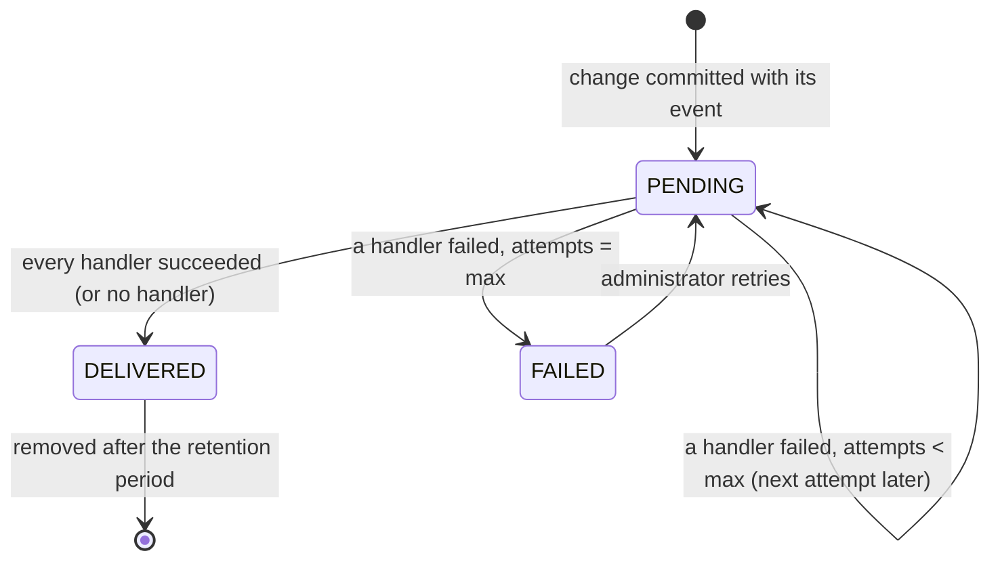
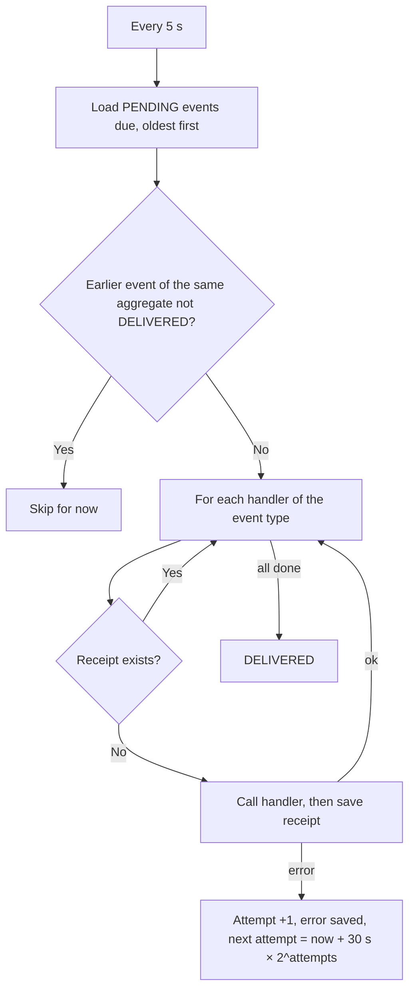

# Workflow — Platform events (REQ-INT-002)

Cross-feature publishers and handlers: [docs/04-workflows/platform-events.md](../../../04-workflows/platform-events.md).

## Event states

```mermaid
stateDiagram-v2
    [*] --> PENDING: change committed with its event
    PENDING --> DELIVERED: every handler succeeded (or no handler)
    PENDING --> PENDING: a handler failed, attempts < max (next attempt later)
    PENDING --> FAILED: a handler failed, attempts = max
    FAILED --> PENDING: administrator retries
    DELIVERED --> [*]: removed after the retention period
```

## Dispatch

```mermaid
flowchart TD
    A[Every 5 s] --> B[Load PENDING events due, oldest first]
    B --> C{Earlier event of the same aggregate not DELIVERED?}
    C -- Yes --> B2[Skip for now]
    C -- No --> D[For each handler of the event type]
    D --> E{Receipt exists?}
    E -- Yes --> D
    E -- No --> F[Call handler, then save receipt]
    F -- error --> G[Attempt +1, error saved, next attempt = now + 30 s × 2^attempts]
    F -- ok --> D
    D -- all done --> H[DELIVERED]
```
