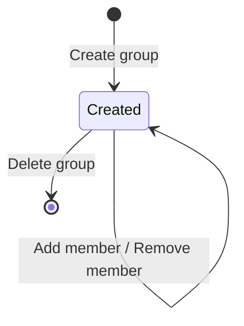

# Workflow — Group Management

## States
No lifecycle beyond exists/deleted — a group is created, has members added or removed any number of times, and is eventually deleted.

## Transitions
| From | To | Actor | Condition / rule | Side effects (notifications, audit) |
|------|----|-------|------------------|-------------------------------------|
| n/a | Created | Admin | BR-TEN-020 | Audit `GROUP_CREATED` |
| Created | Created | Admin | Add member (BR-TEN-022) | Audit `GROUP_MEMBER_ADDED` (skipped if already a member) |
| Created | Created | Admin | Remove member | Audit `GROUP_MEMBER_REMOVED` (skipped if not a member) |
| Created | (deleted) | Admin | BR-TEN-021 | Audit `GROUP_DELETED` |
