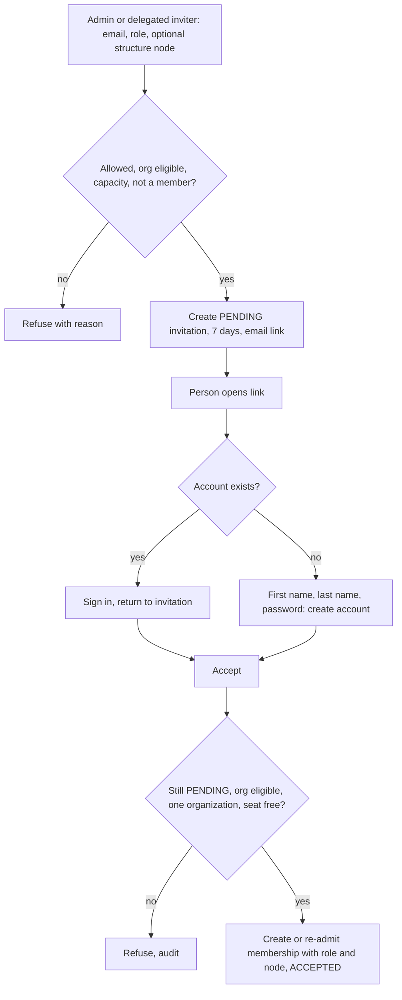

# Workflow — Invite user

```mermaid
flowchart TD
  A[Admin or delegated inviter: email, role, optional structure node] --> B{Allowed, org eligible, capacity, not a member?}
  B -- no --> X[Refuse with reason]
  B -- yes --> C[Create PENDING invitation, 7 days, email link]
  C --> D[Person opens link]
  D --> E{Account exists?}
  E -- yes --> F[Sign in, return to invitation]
  E -- no --> G[First name, last name, password: create account]
  F --> H[Accept]
  G --> H
  H --> I{Still PENDING, org eligible, one organization, seat free?}
  I -- no --> Y[Refuse, audit]
  I -- yes --> J[Create or re-admit membership with role and node, ACCEPTED]
```
