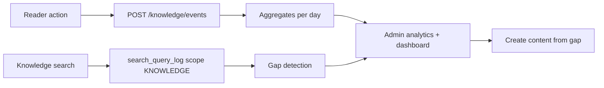

# Workflow — Knowledge analytics

```mermaid
flowchart LR
  R[Reader action] --> E[POST /knowledge/events]
  S[Knowledge search] --> L[search_query_log scope KNOWLEDGE]
  E --> A[Aggregates per day]
  L --> G[Gap detection]
  A --> D[Admin analytics + dashboard]
  G --> D --> C[Create content from gap]
```
