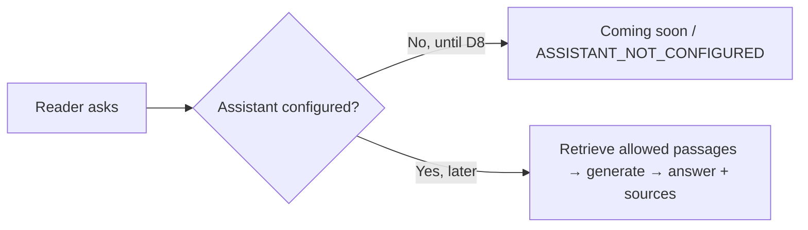

# Workflow — Knowledge assistant

```mermaid
flowchart LR
  Q[Reader asks] --> S{Assistant configured?}
  S -->|No, until D8| N[Coming soon / ASSISTANT_NOT_CONFIGURED]
  S -->|Yes, later| R[Retrieve allowed passages → generate → answer + sources]
```
