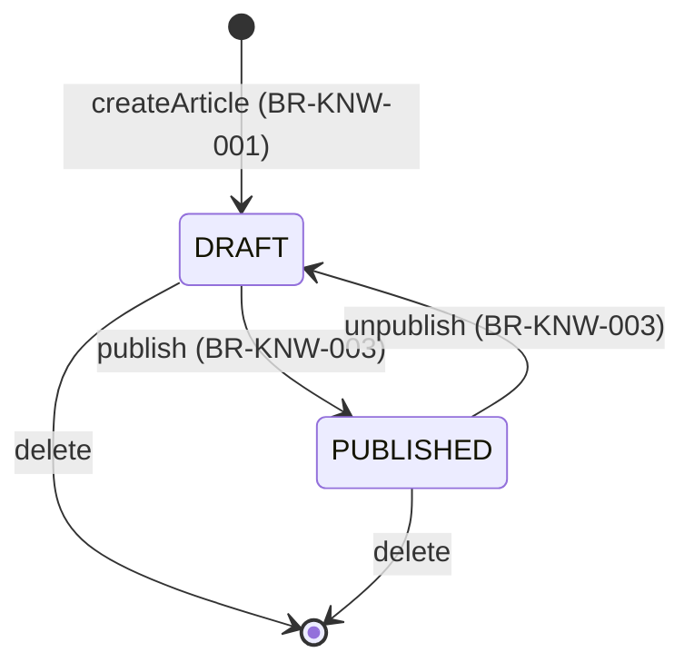

# Workflow — Knowledge Base

## States

Editing (title/body change + version increment, BR-KNW-002) happens from either state and does not itself change status.

## Transitions
| From | To | Actor | Condition / rule | Side effects (notifications, audit) |
|------|----|-------|------------------|-------------------------------------|
| (new) | DRAFT | Admin | BR-KNW-001 | `KNOWLEDGE_ARTICLE_CREATED` audit |
| DRAFT | PUBLISHED | Admin | BR-KNW-003 | `KNOWLEDGE_ARTICLE_PUBLISHED` audit |
| PUBLISHED | DRAFT | Admin | BR-KNW-003 | `KNOWLEDGE_ARTICLE_UNPUBLISHED` audit |
| DRAFT or PUBLISHED | (same status, version + 1) | Admin | BR-KNW-002 | `KNOWLEDGE_ARTICLE_EDITED` audit |
| DRAFT or PUBLISHED | (deleted) | Admin | - | `KNOWLEDGE_ARTICLE_DELETED` audit |
