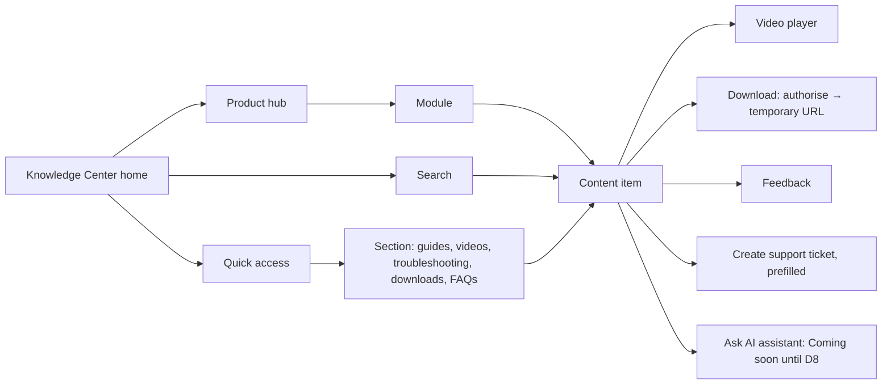

# Workflow — Knowledge Center

```mermaid
flowchart LR
  H[Knowledge Center home] --> S[Search]
  H --> Q[Quick access] --> SEC[Section: guides, videos, troubleshooting, downloads, FAQs]
  H --> P[Product hub] --> M[Module] --> C[Content item]
  S --> C
  SEC --> C
  C --> V[Video player]
  C --> D[Download: authorise → temporary URL]
  C --> F[Feedback]
  C --> T[Create support ticket, prefilled]
  C --> A[Ask AI assistant: Coming soon until D8]
```
No state machine of its own; content states are in REQ-KNW-002.
