# Workflow — Knowledge content

Full flow: [`docs/04-workflows/content-publishing.md`](../../../04-workflows/content-publishing.md).

```mermaid
stateDiagram-v2
  [*] --> Draft
  Draft --> InReview: Submit (contributor or publisher)
  InReview --> Draft: Return with comment (publisher)
  InReview --> Approved: Approve (publisher)
  Approved --> Scheduled: Schedule (publisher, future date)
  Approved --> Published: Publish now (publisher)
  Scheduled --> Published: Scheduled time reached (system)
  Scheduled --> Approved: Unschedule (publisher)
  Published --> Draft: New version started (edit creates a draft; published stays live)
  Published --> Deprecated: Deprecate (publisher)
  Published --> Archived: Archive (publisher)
  Deprecated --> Archived: Archive (publisher)
  Archived --> Draft: Restore (publisher)
```

| From | To | Actor | Rule | Side effects |
|---|---|---|---|---|
| Draft | In review | Contributor/publisher | Required fields valid | Audit; publishers notified (in-app, proposed) |
| In review | Approved / Draft | Publisher | BR-KPRM-002 | Audit |
| Approved | Published / Scheduled | Publisher | BR-KCON-004 snapshot | Audit; search re-index |
| Published | Deprecated / Archived | Publisher | — | Audit; deprecated shows a banner; archived leaves the index |
| Any | Expired (derived) | System | Expiry date passed | Hidden from readers and search |
