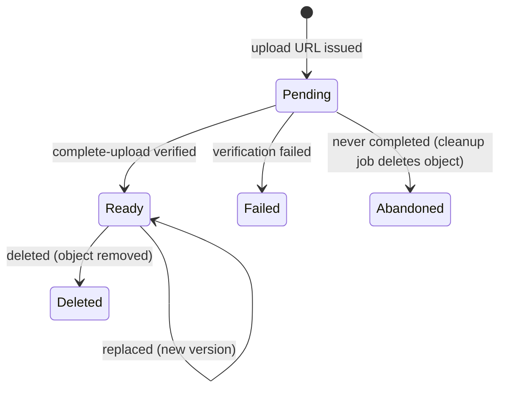

# Workflow — Knowledge media

Upload flow (same as videos): [`docs/04-workflows/video-upload.md`](../../../04-workflows/video-upload.md). Download: [`video-playback.md`](../../../04-workflows/video-playback.md).

