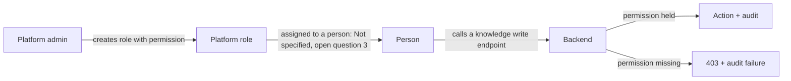

# Workflow — Knowledge permissions

| From | To | Actor | Condition | Side effects |
|---|---|---|---|---|
| No knowledge permission | Contributor | Platform admin | Role with `KNOWLEDGE_CONTRIBUTE` assigned | Audit `KNOWLEDGE_PERMISSION_GRANTED` |
| Contributor | Publisher | Platform admin | Role with `MANAGE_KNOWLEDGE_BASE` assigned | Audit |
| Any | No knowledge permission | Platform admin | Role removed | Audit `KNOWLEDGE_PERMISSION_REMOVED` |
