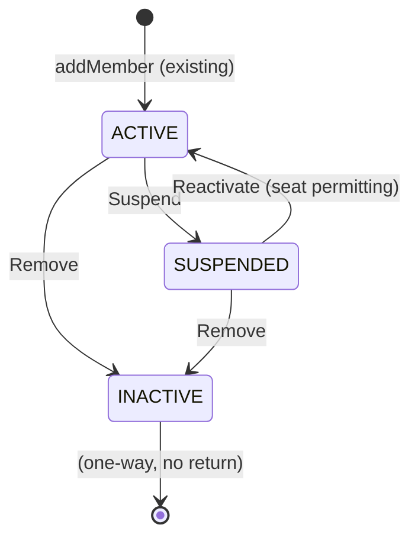

# Workflow — Member Lifecycle & Access Review

## States

## Transitions
| From | To | Actor | Condition / rule | Side effects (notifications, audit) |
|------|----|-------|------------------|-------------------------------------|
| ACTIVE | SUSPENDED | Admin | Not the last active ORG_ADMIN (BR-TEN-010) | Notify member; audit `MEMBER_STATUS_CHANGED` |
| SUSPENDED | ACTIVE | Admin | Seat available (BR-TEN-012) | Notify member; audit `MEMBER_STATUS_CHANGED` |
| ACTIVE/SUSPENDED | INACTIVE | Admin | Not the last active ORG_ADMIN if ACTIVE (BR-TEN-010) | Notify member; audit `MEMBER_STATUS_CHANGED` |
| any | any (unchanged) | Admin | Review access (BR-TEN-014) | Audit `MEMBER_ACCESS_REVIEWED` only |
