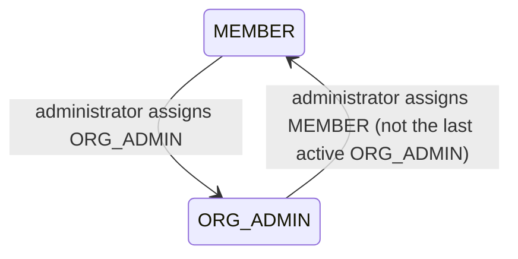

# Workflow — Member Role Assignment

## States

## Transitions
| From | To | Actor | Condition / rule | Side effects (notifications, audit) |
|---|---|---|---|---|
| MEMBER | ORG_ADMIN | Organization administrator | `MANAGE_USERS`; same organization | Target notified; audit `MEMBER_ROLE_CHANGED` |
| ORG_ADMIN | MEMBER | Organization administrator | `MANAGE_USERS`; same organization; at least one other active `ORG_ADMIN` remains | Target notified; audit `MEMBER_ROLE_CHANGED` |
