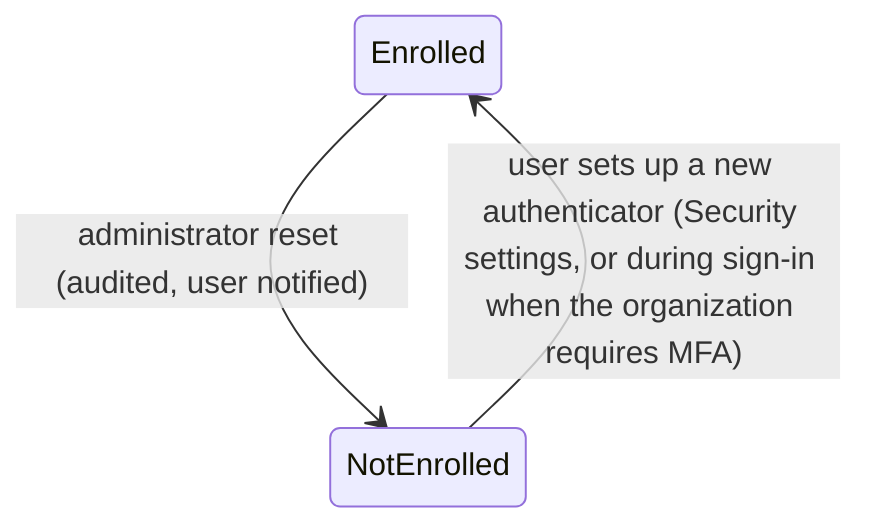

# Workflow — MFA Recovery

```mermaid
stateDiagram-v2
    Enrolled --> NotEnrolled: administrator reset (audited, user notified)
    NotEnrolled --> Enrolled: user sets up a new authenticator (Security settings, or during sign-in when the organization requires MFA)
```
