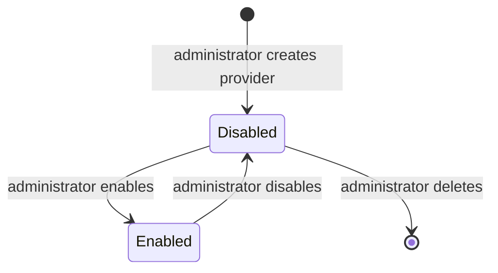

# Workflow — OIDC Identity-Provider Federation

## States

## Transitions
| From | To | Actor | Condition / rule | Side effects (notifications, audit) |
|---|---|---|---|---|
| - | Disabled | Organization administrator | Not specified (to confirm: `MANAGE_ORGANIZATION`) | Not specified (to confirm: audit) |
| Disabled | Enabled | Organization administrator | Not specified | Not specified |
| Enabled | Disabled | Organization administrator | Not specified | Not specified |
