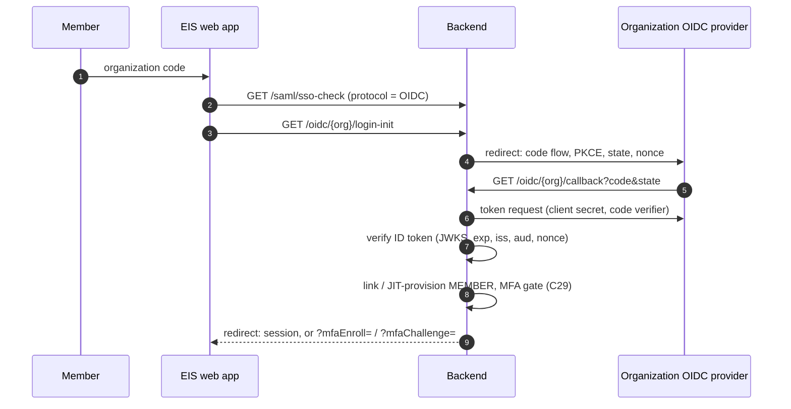

# Workflow — OIDC Identity-Provider Federation

```mermaid
sequenceDiagram
  autonumber
  participant U as Member
  participant W as EIS web app
  participant A as Backend
  participant I as Organization OIDC provider
  U->>W: organization code
  W->>A: GET /saml/sso-check (protocol = OIDC)
  W->>A: GET /oidc/{org}/login-init
  A->>I: redirect: code flow, PKCE, state, nonce
  I->>A: GET /oidc/{org}/callback?code&state
  A->>I: token request (client secret, code verifier)
  A->>A: verify ID token (JWKS, exp, iss, aud, nonce)
  A->>A: link / JIT-provision MEMBER, MFA gate (C29)
  A-->>W: redirect: session, or ?mfaEnroll= / ?mfaChallenge=
```

Provider states: Disabled ⇄ Enabled. Enabling one disables any other enabled SAML or OIDC provider of the organization.
