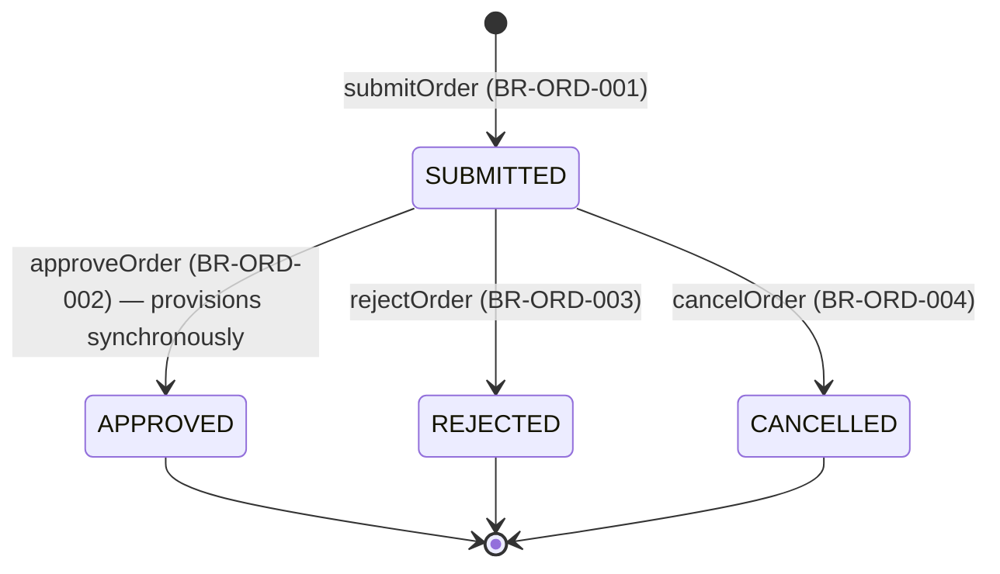

# Workflow — Order Lifecycle

## States

No PROVISIONED state — APPROVED already means provisioned (see this feature's own requirement.md). Every non-SUBMITTED status is terminal.

## Transitions
| From | To | Actor | Condition / rule | Side effects (notifications, audit) |
|------|----|-------|------------------|-------------------------------------|
| (new) | SUBMITTED | Any active member | BR-ORD-001 | `ORDER_SUBMITTED` audit; notifies every ACTIVE ORG_ADMIN |
| SUBMITTED | APPROVED | ORG_ADMIN (MANAGE_ORDERS) | BR-ORD-002 | Provisions the organization's subscription; `ORDER_APPROVED` audit; notifies the requester |
| SUBMITTED | REJECTED | ORG_ADMIN (MANAGE_ORDERS) | BR-ORD-003 | `ORDER_REJECTED` audit; notifies the requester |
| SUBMITTED | CANCELLED | The requester | BR-ORD-004 | `ORDER_CANCELLED` audit |
