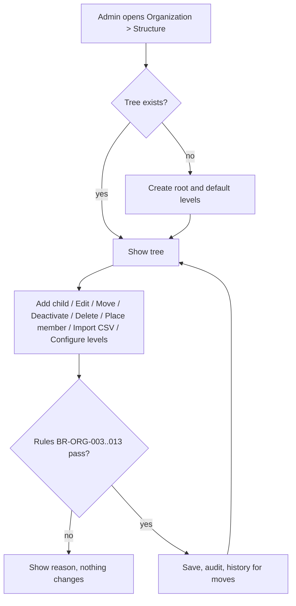

# Workflow — Organization hierarchy

```mermaid
flowchart TD
  A[Admin opens Organization > Structure] --> B{Tree exists?}
  B -- no --> C[Create root and default levels]
  B -- yes --> D[Show tree]
  C --> D
  D --> E[Add child / Edit / Move / Deactivate / Delete / Place member / Import CSV / Configure levels]
  E --> F{Rules BR-ORG-003..013 pass?}
  F -- no --> G[Show reason, nothing changes]
  F -- yes --> H[Save, audit, history for moves]
  H --> D
```
