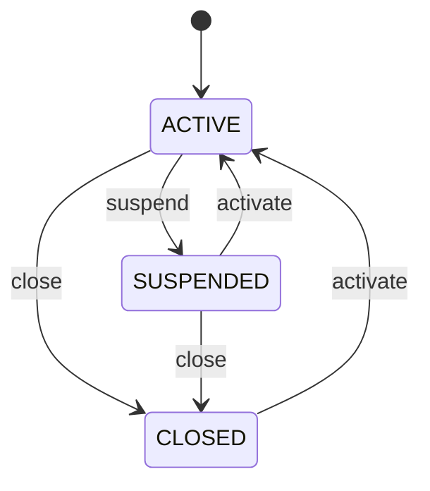

# Workflow — Organization Lifecycle

## States

The lifecycle status is separate from the registration status (`PENDING_EMAIL_VERIFICATION` … `COMPLETED`), which only tracks self-registration.

## Transitions
| From | To | Actor | Condition / rule | Side effects |
|---|---|---|---|---|
| ACTIVE | SUSPENDED | Platform administrator | `MANAGE_REGISTRATIONS`; not a member (BR-TEN-006) | Active members' logins disabled and sessions ended; audit `ORGANIZATION_SUSPENDED` |
| ACTIVE, SUSPENDED | CLOSED | Platform administrator | `MANAGE_REGISTRATIONS`; not a member | Same as suspend; audit `ORGANIZATION_CLOSED` |
| SUSPENDED, CLOSED | ACTIVE | Platform administrator | `MANAGE_REGISTRATIONS` | Active members' logins enabled, unless registration is pending email verification (BR-TEN-007); audit `ORGANIZATION_ACTIVATED` |
