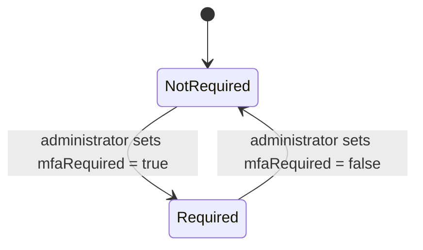

# Workflow — Organization MFA Policy

## States

## Transitions
| From | To | Actor | Condition / rule | Side effects (notifications, audit) |
|---|---|---|---|---|
| Not required | Required | Organization administrator | Caller holds `MANAGE_ORGANIZATION` | Audit `MFA_POLICY_CHANGED`. Applies at members' next login; no sign-out |
| Required | Not required | Organization administrator | Caller holds `MANAGE_ORGANIZATION` | Audit `MFA_POLICY_CHANGED` |
