# Workflow — Platform Administration

## States
Currencies, regions and feature flags each have a simple enabled/disabled state; regions and feature flags additionally exist/don't exist.

```mermaid
stateDiagram-v2
    [*] --> Enabled: Seeded (currency) / Created (region, flag)
    Enabled --> Disabled: Admin toggles off
    Disabled --> Enabled: Admin toggles on
    Enabled --> [*]: Delete (region: only if unassigned; flag: always)
    Disabled --> [*]: Delete (region: only if unassigned; flag: always)
```

## Transitions
| From | To | Actor | Condition / rule | Side effects (notifications, audit) |
|------|----|-------|------------------|-------------------------------------|
| n/a | Currency row exists | Backend startup (seeder) | BR-GOV-001 | None |
| Currency enabled | disabled (or back) | Admin | — | Audit `PLATFORM_CURRENCY_UPDATED` |
| n/a | Region exists | Admin | BR-GOV-002 | Audit `PLATFORM_REGION_CREATED` |
| Region exists | deleted | Admin | BR-GOV-003 (refused if assigned) | Audit `PLATFORM_REGION_DELETED` |
| n/a | Flag exists | Admin | BR-GOV-004 | Audit `PLATFORM_FEATURE_FLAG_CREATED` |
| Flag exists | deleted | Admin | — | Audit `PLATFORM_FEATURE_FLAG_DELETED`; `isEnabled` then fails open (BR-GOV-005) |
