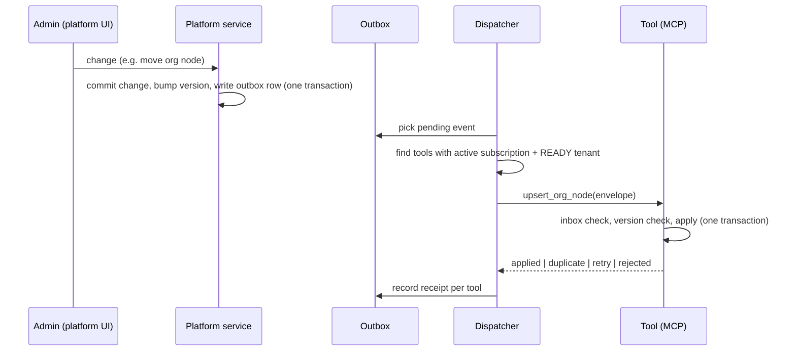
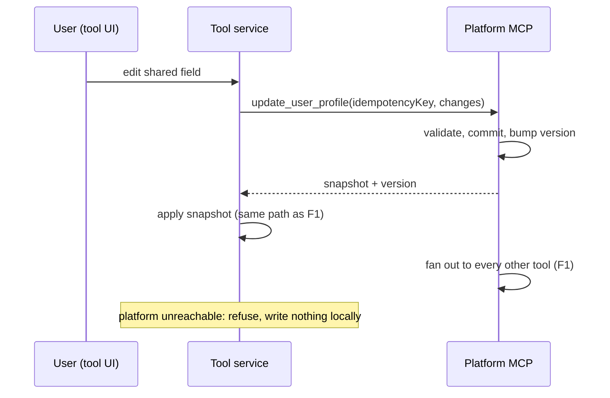
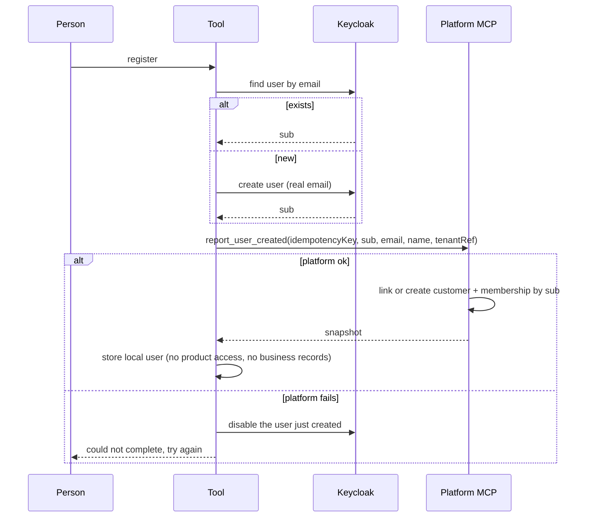

# Workflow — Platform ↔ tool synchronization

States of a delivery (platform → one tool): `PENDING` → `DELIVERED` | `RETRYING` → `FAILED` → (retry/replay) → `PENDING`.
States of a tenant for an organization and tool: `PENDING` → `READY` | `FAILED`; `READY` ⇄ `SUSPENDED`.

## F1 Platform change fans out


## F2 Edit made inside a tool (write-through)


## F3 Registration inside a tool


## F4 Subscription or access change
Platform writes the change and a `SubscriptionChanged` / `UserProductAccessGranted|Revoked` event (version bumped) → F1 delivery → tool updates `platform_subscription` / `platform_user_access` and clears its entitlement cache → the next request is checked against the new data.

## F5 Provisioning
```mermaid
sequenceDiagram
  participant P as Platform
  participant T as Tool
  P->>P: subscription starts; registry entry PENDING
  P->>T: provision_tenant(tenantRef, organization, firstAdmin, schemaVersion)
  T->>T: resolve datasource from its registry, create/verify schema, migrate, create root + admin
  T-->>P: status READY, schemaVersion
  P->>P: registry READY
  P->>T: upsert_* for hierarchy, users, subscription, access (F1)
```
A failure leaves the entry `FAILED` with the error; the next identical call resumes. Nothing is deleted.

## F6 Request check in a tool
1. Token valid (signature, issuer, audience, expiry). 2. Tenant resolved through the registry; the user must exist in that tenant. 3. User active. 4. Organization active. 5. Subscription effective now. 6. Product access active. 7. Tenant READY. 8. Tool permission for the action. 9. Sensitive action → ask the platform; no answer → deny.

## F7 Reconcile
Every interval the platform asks each tool for a digest per aggregate type (count and hash of `(id, version)`), compares with its own, asks for `(id, version)` pairs where they differ, and resends what is missing or older.
