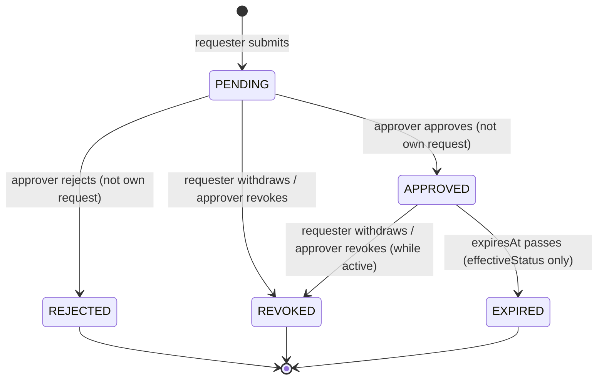

# Workflow — Privileged Access (User and Organization Administrator)

## States

## Transitions
| From | To | Actor | Condition / rule | Side effects (notifications, audit) |
|---|---|---|---|---|
| - | PENDING | Requester | Valid permission, justification, 1–480 minutes; not `MANAGE_PRIVILEGED_ACCESS` | Audit `REQUESTED`, `PRIVILEGED_ACCESS_REQUESTED` |
| PENDING | APPROVED | Organization administrator | Standing `MANAGE_PRIVILEGED_ACCESS`; same organization; not own request | Expiry set; requester notified; audit `APPROVED` |
| PENDING | REJECTED | Organization administrator | Same as approve | Requester notified (with note); audit `REJECTED` |
| PENDING or active APPROVED | REVOKED | Organization administrator | Standing `MANAGE_PRIVILEGED_ACCESS`; same organization | Audit `REVOKED` |
| PENDING or active APPROVED | REVOKED | Requester | Own request | Audit `REVOKED` |
| APPROVED | EXPIRED (display) | System (time) | `expiresAt` passed | None (computed) |
