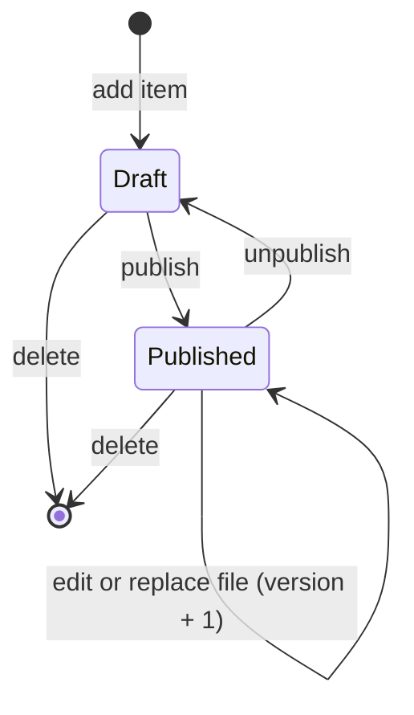
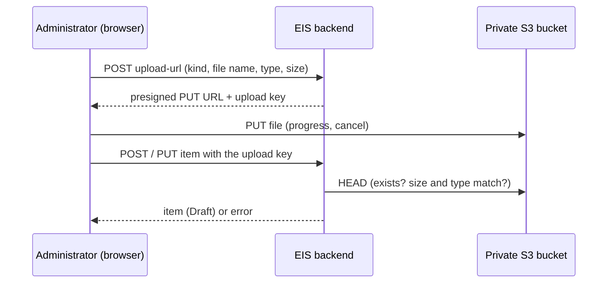

# Workflow — Product content

## States

## Uploading a file

## Transitions
| From | To | Actor | Condition / rule | Side effects |
|---|---|---|---|---|
| (new) | Draft | Administrator | BR-PCON-001, -009 | Audit `PRODUCT_CONTENT_ADDED` |
| Draft | Published | Administrator | The item is complete (file or link present) | Audit `PRODUCT_CONTENT_PUBLISHED`; item appears on the product page |
| Published | Draft | Administrator | | Audit `PRODUCT_CONTENT_UNPUBLISHED`; item disappears |
| Draft / Published | same | Administrator | BR-PCON-008 | Version + 1, "Updated on", old file deleted; audit `PRODUCT_CONTENT_UPDATED` |
| any | deleted | Administrator | confirmation in the UI | Files deleted; audit `PRODUCT_CONTENT_DELETED` |
