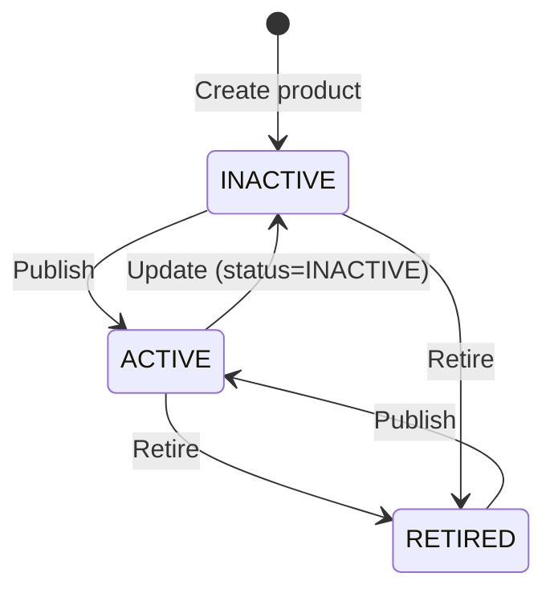

# Workflow — Product Lifecycle & Structure

## States

## Transitions
| From | To | Actor | Condition / rule | Side effects (notifications, audit) |
|------|----|-------|------------------|-------------------------------------|
| INACTIVE/RETIRED | ACTIVE | Admin | BR-CAT-002 | Product reappears in the public storefront and search |
| ACTIVE/INACTIVE | RETIRED | Admin | BR-CAT-003, BR-CAT-004 | Product disappears from the public storefront; existing subscriptions/access untouched (BR-CAT-006) |
| n/a | version+1 | Admin (any update) | BR-CAT-001 | None — display only |
