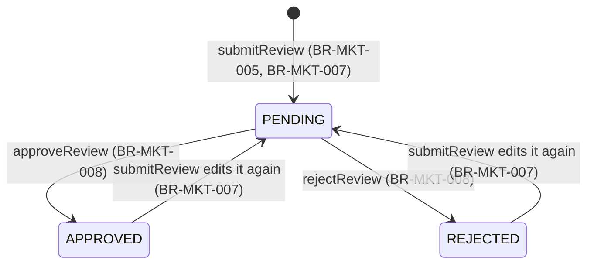

# Workflow — Product Reviews & Ratings

## States

APPROVED and REJECTED are terminal only with respect to moderation (BR-MKT-008 refuses deciding them again) — the customer can always re-edit their own review, which resets it to PENDING regardless of its current status.

## Transitions
| From | To | Actor | Condition / rule | Side effects (notifications, audit) |
|------|----|-------|------------------|-------------------------------------|
| (new) | PENDING | Customer | BR-MKT-005 | `REVIEW_SUBMITTED` audit |
| PENDING | APPROVED | Admin (MANAGE_REVIEWS) | BR-MKT-008 | `REVIEW_APPROVED` audit; now counted in the public average |
| PENDING | REJECTED | Admin (MANAGE_REVIEWS) | BR-MKT-008 | `REVIEW_REJECTED` audit |
| APPROVED or REJECTED | PENDING | Customer (same review, edited) | BR-MKT-006, BR-MKT-007 | `REVIEW_SUBMITTED` audit; removed from the public average until re-approved |
