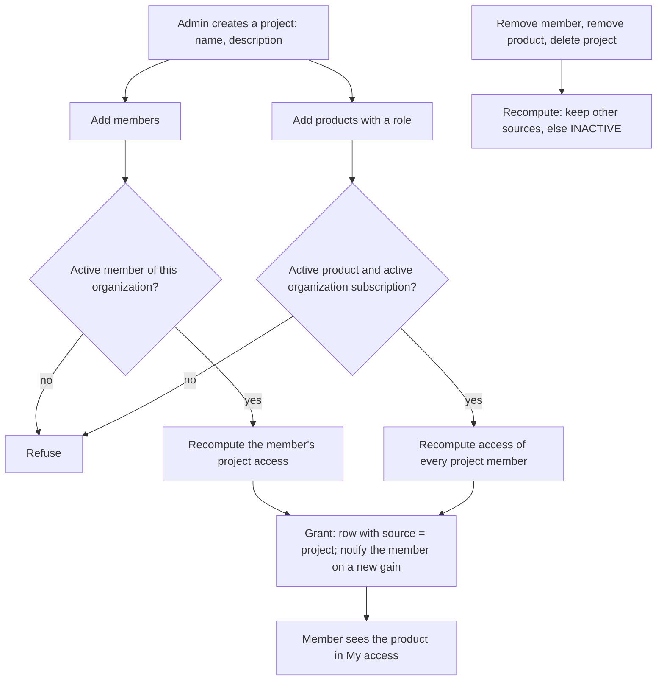

# Workflow — Projects

```mermaid
flowchart TD
  A[Admin creates a project: name, description] --> B[Add members]
  A --> C[Add products with a role]
  B --> D{Active member of this organization?}
  D -- no --> X[Refuse]
  D -- yes --> E[Recompute the member's project access]
  C --> F{Active product and active organization subscription?}
  F -- no --> X
  F -- yes --> G[Recompute access of every project member]
  E --> H[Grant: row with source = project; notify the member on a new gain]
  G --> H
  H --> I[Member sees the product in My access]
  J[Remove member, remove product, delete project] --> K[Recompute: keep other sources, else INACTIVE]
```
