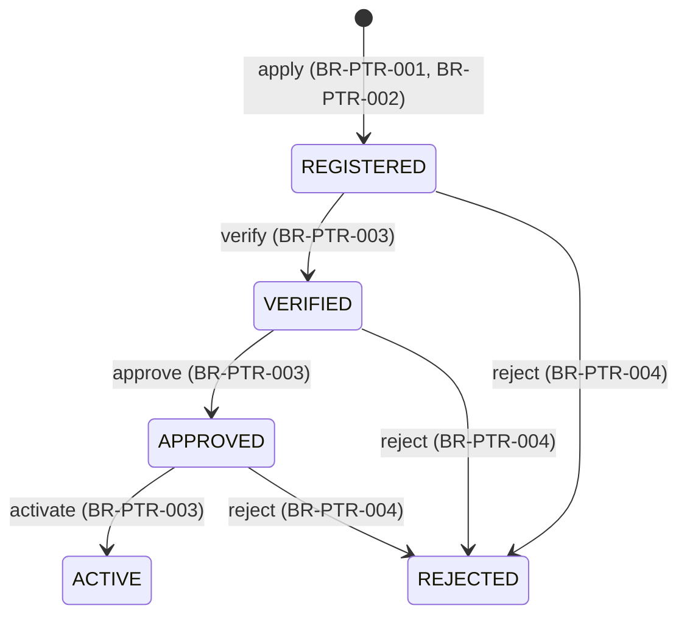
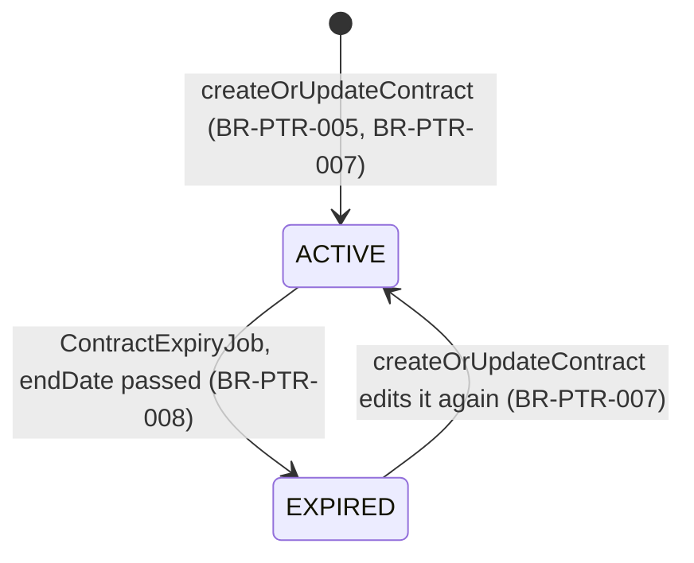

# Workflow — Provider Onboarding

## States — Provider

ACTIVE and REJECTED are both terminal — neither can be rejected or moved forward again (BR-PTR-004).

## States — Contract

## Transitions — Provider
| From | To | Actor | Condition / rule | Side effects (notifications, audit) |
|------|----|-------|------------------|-------------------------------------|
| (new) | REGISTERED | Prospective partner (public) | BR-PTR-001, BR-PTR-002 | `PROVIDER_REGISTERED` audit |
| REGISTERED | VERIFIED | Admin (MANAGE_PARTNERS) | BR-PTR-003 | `PROVIDER_VERIFIED` audit |
| VERIFIED | APPROVED | Admin (MANAGE_PARTNERS) | BR-PTR-003 | `PROVIDER_APPROVED` audit |
| APPROVED | ACTIVE | Admin (MANAGE_PARTNERS) | BR-PTR-003 | `PROVIDER_ACTIVATED` audit |
| REGISTERED/VERIFIED/APPROVED | REJECTED | Admin (MANAGE_PARTNERS) | BR-PTR-004 | `PROVIDER_REJECTED` audit |

## Transitions — Contract
| From | To | Actor | Condition / rule | Side effects (notifications, audit) |
|------|----|-------|------------------|-------------------------------------|
| (new) | ACTIVE | Admin (MANAGE_PARTNERS) | BR-PTR-005, BR-PTR-006 | `PARTNER_CONTRACT_SAVED` audit |
| ACTIVE | EXPIRED | `ContractExpiryJob` (scheduled) | BR-PTR-008 | `PARTNER_CONTRACT_EXPIRED` audit |
| ACTIVE or EXPIRED | ACTIVE | Admin (MANAGE_PARTNERS), same contract edited | BR-PTR-005, BR-PTR-007 | `PARTNER_CONTRACT_SAVED` audit |
