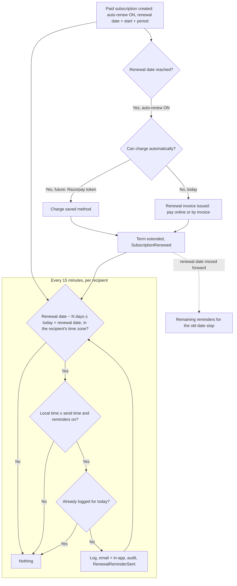

# Workflow — Auto-renewal and renewal reminders (REQ-SUB-004)

```mermaid
flowchart TD
    S[Paid subscription created: auto-renew ON, renewal date = start + period] --> R1
    subgraph Reminders [Every 15 minutes, per recipient]
      R1{Renewal date − N days ≤ today < renewal date, in the recipient's time zone?} -- No --> R0[Nothing]
      R1 -- Yes --> R2{Local time ≥ send time and reminders on?}
      R2 -- No --> R0
      R2 -- Yes --> R3{Already logged for today?}
      R3 -- Yes --> R0
      R3 -- No --> R4[Log, email + in-app, audit, RenewalReminderSent]
    end
    R4 --> R1
    S --> T{Renewal date reached?}
    T -- Yes, auto-renew ON --> U{Can charge automatically?}
    U -- Yes, future: Razorpay token --> V[Charge saved method]
    U -- No, today --> W[Renewal invoice issued: pay online or by invoice]
    V --> X[Term extended, SubscriptionRenewed]
    W --> X
    X --> R1
    X -. renewal date moved forward .-> Stop[Remaining reminders for the old date stop]
```
