# Workflow — Role and Permission Administration

## States

```mermaid
stateDiagram-v2
    [*] --> Active: create (role or permission)
    Active --> Active: edit description / permission set
    Active --> [*]: delete (not system-managed; permission not granted by any role)
```

## Transitions
| From | To | Actor | Condition / rule | Side effects (notifications, audit) |
|---|---|---|---|---|
| - | Role exists | Platform administrator | `MANAGE_ROLES`; unique name; ORGANIZATION scope name is `ORG_ADMIN` or `MEMBER` | Audit `ROLE_CREATED` |
| Role exists | Role exists | Platform administrator | `MANAGE_ROLES`; name and scope unchanged | Audit `ROLE_UPDATED` |
| Role exists | Deleted | Platform administrator | `MANAGE_ROLES`; not system-managed | Audit `ROLE_DELETED` |
| - | Permission exists | Platform administrator | `MANAGE_PERMISSIONS`; unique name | Audit `PERMISSION_CREATED` |
| Permission exists | Permission exists | Platform administrator | `MANAGE_PERMISSIONS`; name unchanged | Audit `PERMISSION_UPDATED` |
| Permission exists | Deleted | Platform administrator | `MANAGE_PERMISSIONS`; not system-managed; no role grants it | Audit `PERMISSION_DELETED` |
