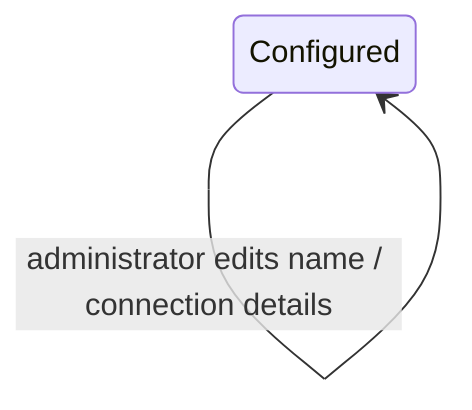

# Workflow — SAML Federation — Edit Provider

## States

## Transitions
| From | To | Actor | Condition / rule | Side effects (notifications, audit) |
|---|---|---|---|---|
| Configured (enabled or disabled) | Configured (same enabled state) | Organization administrator | `MANAGE_ORGANIZATION`; provider in own organization; valid metadata or manual details | Audit `SAML_PROVIDER_UPDATED` |
