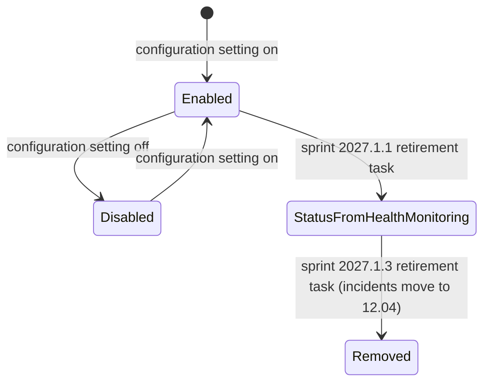

# Workflow — Interim Service Status Page

## States

## Transitions
| From | To | Actor | Condition / rule | Side effects (notifications, audit) |
|---|---|---|---|---|
| Enabled | Disabled | Operator (configuration) | Setting switched off | Not specified |
| Enabled | Status from Health Monitoring | Development team | Sprint 2027.1.1 retirement task | Not specified |
| Status from Health Monitoring | Removed | Development team | Sprint 2027.1.3 retirement task | Not specified |
