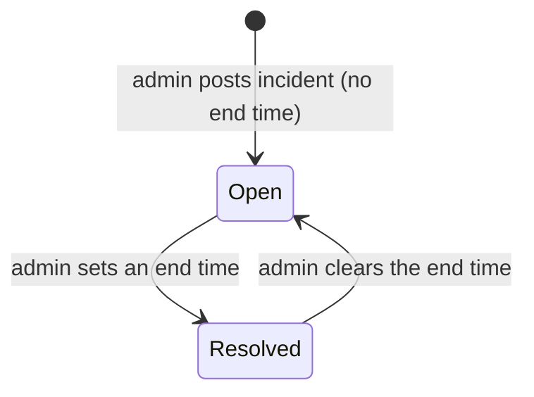
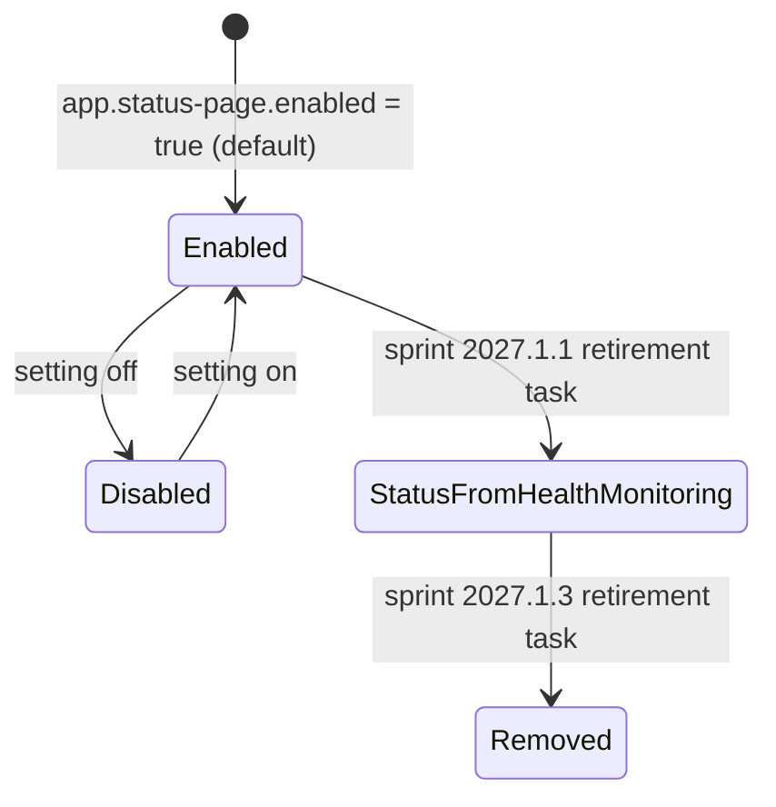

# Workflow — Interim Service Status Page

## Incident

## Page lifecycle

## Transitions
| From | To | Actor | Condition / rule | Side effects |
|---|---|---|---|---|
| — | Open | Platform admin | `MANAGE_SERVICE_STATUS`; active product | Audit `INCIDENT_POSTED`; dashboard alert for purchasers |
| Open | Resolved | Platform admin | End time not before start | Audit `INCIDENT_UPDATED` |
| Enabled | Disabled | Operator (configuration) | Setting off | Customer view returns `enabled: false` |
