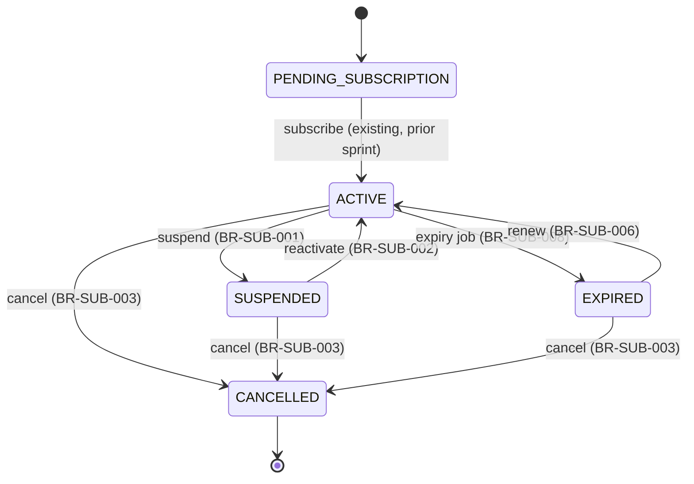

# Workflow — Subscription Lifecycle

## States

Change plan (BR-SUB-007) does not move between these states — it only changes `planId`, on any status except CANCELLED.

## Transitions
| From | To | Actor | Condition / rule | Side effects (notifications, audit) |
|------|----|-------|------------------|-------------------------------------|
| ACTIVE | SUSPENDED | Customer | BR-SUB-001 | `SUBSCRIPTION_SUSPENDED` audit; notification |
| SUSPENDED | ACTIVE | Customer | BR-SUB-002 | `SUBSCRIPTION_REACTIVATED` audit; notification |
| ACTIVE / SUSPENDED / EXPIRED / PENDING_SUBSCRIPTION | CANCELLED | Customer | BR-SUB-003 | `SUBSCRIPTION_CANCELLED` audit; notification |
| ACTIVE | EXPIRED | Scheduled job | BR-SUB-008 (`expiresAt` passed) | `SUBSCRIPTION_EXPIRED` audit; notification |
| Any non-CANCELLED | (same status, `expiresAt` extended) | Customer | BR-SUB-005 | `SUBSCRIPTION_RENEWED` audit; notification |
| EXPIRED | ACTIVE | Customer (via renew) | BR-SUB-006 | `SUBSCRIPTION_RENEWED` audit; notification |
| Any non-CANCELLED | (same status, `planId` changed) | Customer | BR-SUB-007 | `SUBSCRIPTION_PLAN_CHANGED` audit |
