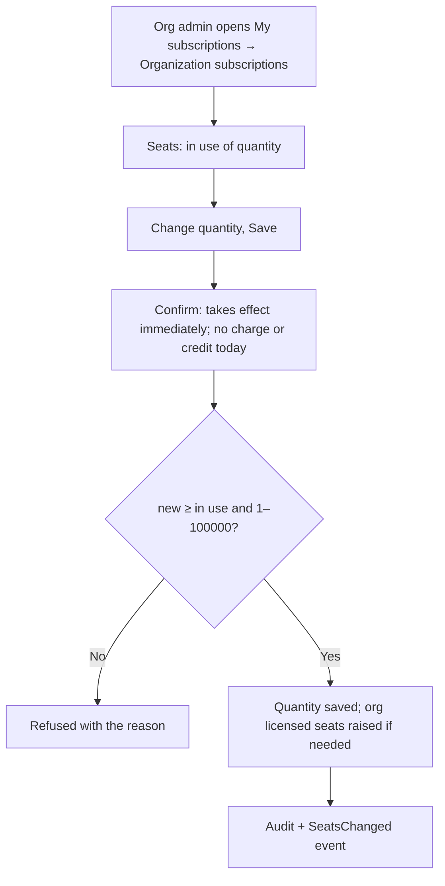

# Workflow — Seats and quantity (REQ-SUB-003)

```mermaid
flowchart TD
    A[Org admin opens My subscriptions → Organization subscriptions] --> B[Seats: in use of quantity]
    B --> C[Change quantity, Save]
    C --> D[Confirm: takes effect immediately; no charge or credit today]
    D --> E{new ≥ in use and 1–100000?}
    E -- No --> F[Refused with the reason]
    E -- Yes --> G[Quantity saved; org licensed seats raised if needed]
    G --> H[Audit + SeatsChanged event]
```
