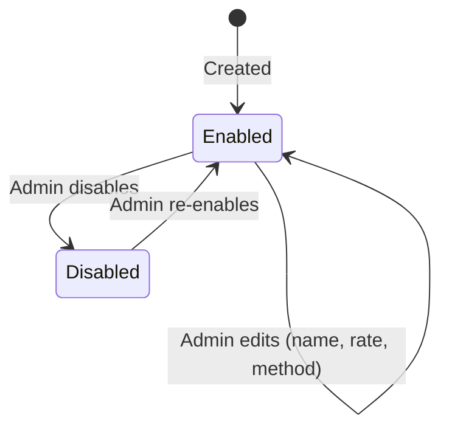

# Workflow — Tax Rules and Calculation (REQ-BIL-002)

## Calculation decision flow
Runs once per invoice, at invoice-generation time (inside `InvoiceService#generateForSubscription`, REQ-BIL-001.2).

```mermaid
flowchart TD
    A[Invoice generation starts] --> B[Resolve customer's region]
    B --> C{Enabled tax rule for this region<br/>at today's effective-from date?}
    C -- No --> D[Tax = 0<br/>Invoice line shows<br/>"No tax rule for this region"]
    C -- Yes --> E{Rule's method}
    E -- Admin rate --> F[Tax = amount x rule.rate<br/>Method used = Admin rate]
    E -- Tax service --> G{Tax service configured<br/>and reachable?}
    G -- Yes --> H[Call tax service<br/>Method used = Tax service]
    H -- Service call fails --> F
    G -- No --> F
    F --> I[Copy tax name, rate, amount<br/>and method used onto the invoice]
    H --> I
    D --> I
    I --> J[Invoice finalized —<br/>later rule changes never alter it]
```

## Tax rule states

Editing a rule changes future calculations only — see BR-5.

## Actors
| Step | Actor |
|---|---|
| Create, edit, enable, disable a tax rule | Platform admin (`MANAGE_BILLING`) |
| Calculate tax at invoice time | `InvoiceService` (system), calling the tax calculation service |
| Calculate (external) | Tax service, when configured and the region's method is Tax service |
