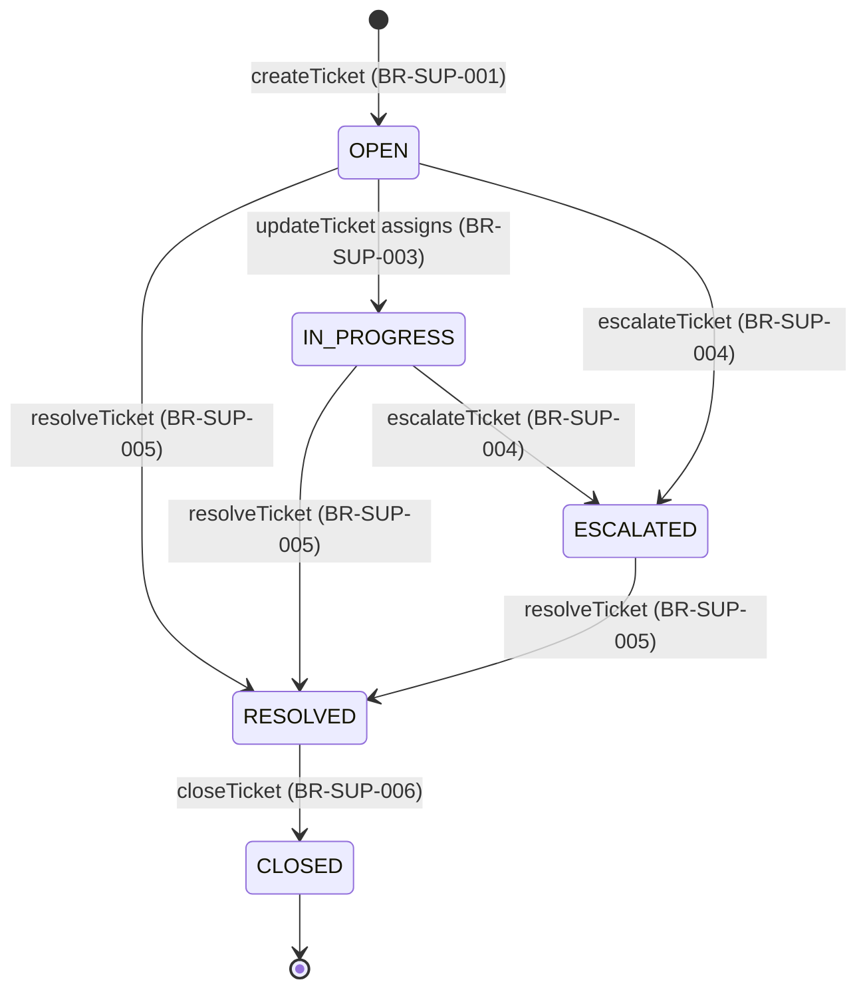

# Workflow — Ticket Management

## States

Categorize/Prioritize/Assign do not change status by themselves except the OPEN→IN_PROGRESS move on assignment (BR-SUP-003); every other transition above is the whole effect of its own action. RESOLVED and CLOSED are otherwise terminal — no action in this feature reopens a ticket.

## Transitions
| From | To | Actor | Condition / rule | Side effects (notifications, audit) |
|------|----|-------|------------------|-------------------------------------|
| (new) | OPEN | Customer | BR-SUP-001 | `TICKET_CREATED` audit |
| OPEN | IN_PROGRESS | Admin | BR-SUP-003 (assign) | `TICKET_UPDATED` audit |
| OPEN / IN_PROGRESS | ESCALATED | Admin | BR-SUP-004 | `TICKET_ESCALATED` audit; notifies the requester |
| OPEN / IN_PROGRESS / ESCALATED | RESOLVED | Admin | BR-SUP-005 | `TICKET_RESOLVED` audit; notifies the requester |
| RESOLVED | CLOSED | Admin | BR-SUP-006 | `TICKET_CLOSED` audit |
