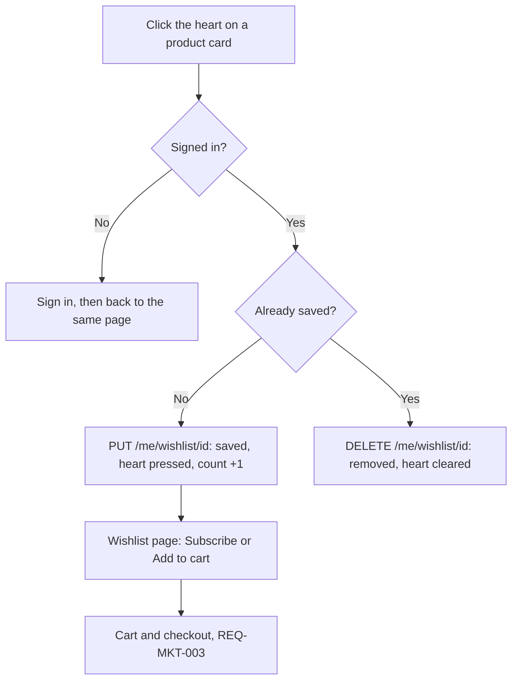

# Workflow — Wishlist (REQ-MKT-004)

```mermaid
flowchart TD
    A[Click the heart on a product card] --> B{Signed in?}
    B -- No --> C[Sign in, then back to the same page]
    B -- Yes --> D{Already saved?}
    D -- No --> E[PUT /me/wishlist/id: saved, heart pressed, count +1]
    D -- Yes --> F[DELETE /me/wishlist/id: removed, heart cleared]
    E --> G[Wishlist page: Subscribe or Add to cart]
    G --> H[Cart and checkout, REQ-MKT-003]
```
