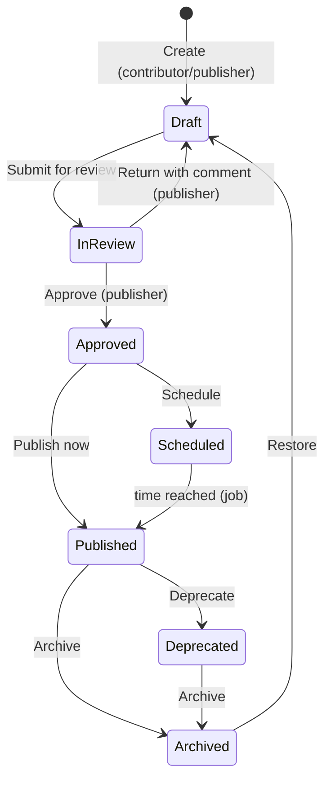

# Workflow — Knowledge content publishing

**Status:** Built 2026-10-05 ([C78](../01-business/roadmap/open-decisions.md#c78)); defined 2026-10-05). [REQ-KNW-002](../02-requirements/FRD/knowledge-content/requirement.md), [REQ-KNW-008](../02-requirements/FRD/knowledge-permissions/requirement.md).

| Step | Who | Effects |
|---|---|---|
| Save draft | Contributor, publisher | Version stays unpublished; audit KNOWLEDGE_CONTENT_EDITED |
| Preview | Contributor, publisher | Renders with Knowledge Center components for a chosen audience |
| Submit | Contributor, publisher | In review; publishers notified in-app — not built (Not specified, C78) |
| Approve / Return | Publisher | Audit; comment to the author on return |
| Publish / Schedule | Publisher | Version snapshot (1.0, 1.1, 2.0); search re-index; audit KNOWLEDGE_CONTENT_PUBLISHED |
| Deprecate / Archive | Publisher | Deprecated shows a banner; Archived leaves readers and search |
| Restore version | Publisher | Old snapshot copied into a new Draft |
| Expiry date reached | System | Hidden from readers and search (Expired) |
