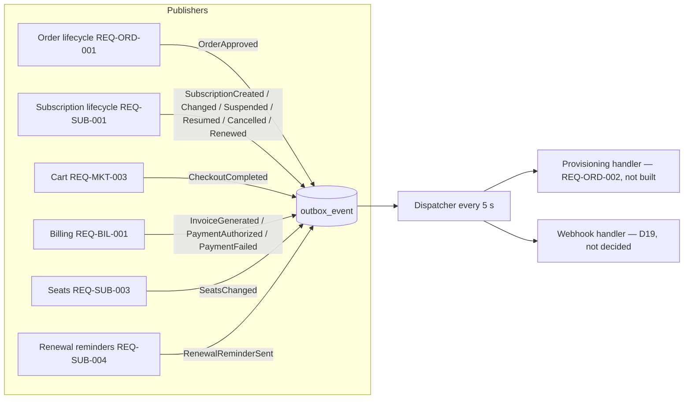

# Workflow — Platform events

Requirement: [REQ-INT-002](../02-requirements/FRD/event-platform/requirement.md), decision [C62](../01-business/roadmap/open-decisions.md#c62). Every publisher writes its event in the same transaction as its change; the dispatcher delivers to handlers.

| Event | Publisher (code) | Handlers today |
|---|---|---|
| `OrderApproved` | `OrderService.approveOrder` | None (planned: provisioning) |
| `SubscriptionCreated` | `SubscriptionService.subscribe`, `subscribeOrganization`, `subscribeFromCart` | None (planned: provisioning) |
| `SubscriptionChanged` | `SubscriptionService.changePlan` | None |
| `SubscriptionSuspended` / `SubscriptionResumed` / `SubscriptionCancelled` | `SubscriptionService.suspend/reactivate/cancelSubscription` | None (planned: provisioning) |
| `SubscriptionRenewed` | `SubscriptionService.renewSubscription`, auto-renew job | None |
| `CheckoutCompleted` | `CartService.checkout` | None |
| `InvoiceGenerated` | `InvoiceService.generateForSubscriptions` | None |
| `PaymentAuthorized` / `PaymentFailed` | `PaymentService.confirmPayment` and webhook, `OfflinePaymentService.recordOfflinePayment` | None |
| `SeatsChanged` | `SubscriptionSeatService.changeSeats` | None |
| `RenewalReminderSent` | `RenewalReminderService` | None |

With no handler, an event is marked DELIVERED (REQ-INT-002.3); it stays visible in the admin view until retention removes it.
